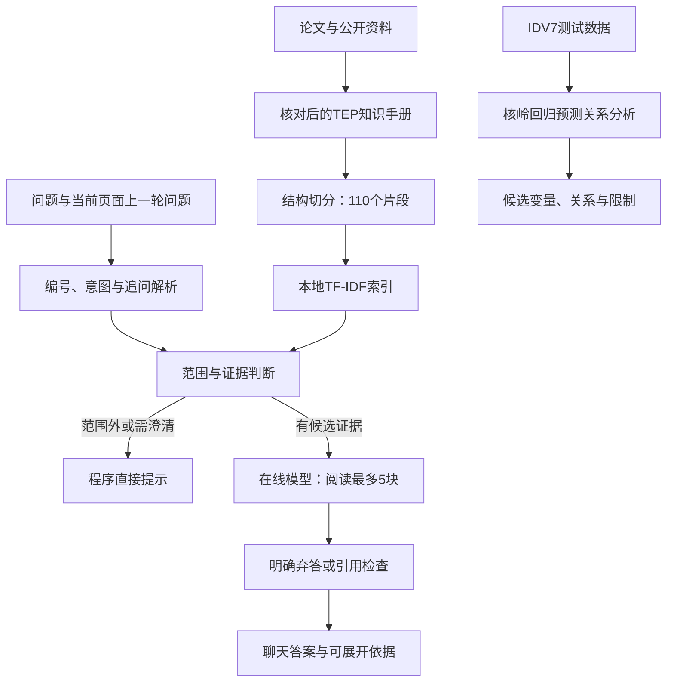

# TEP故障助手 v1.0：演示与交付说明

这是面向TEP工艺、变量和预设故障的本地专业助手。范围外问题拒答，证据不足时明确说明；不提供通用聊天，不具备实时设备监测能力。

2026-09-28整页重构已完成：建议演示时先用顶部动画介绍工艺，再从设备进入知识问答，最后分析IDV(7)并选择一条路径追踪。图和路径优先展示，矩阵与数值依据可按需展开。详细交互与检查记录见 [PRODUCT_REDESIGN.md](PRODUCT_REDESIGN.md)。

## 一、已经完成什么

两个功能在一个网页中运行：

1. 知识问答：整理有来源与版本的知识手册，生成110个片段，构建本地字符TF-IDF索引，结合编号、意图与有限追问规则检索，再调用在线模型生成带引用的回答。
2. 故障分析：对IDV(7)测试数据的选定变量建立完整与缺省核岭回归模型，比较时序预测误差，显示候选变量与预测关系。

系统实际结构：



领域范围检查是有限规则，模型也被要求遵守范围与证据限制。它们仍可能误判，需要持续保留失败案例。检索找到片段不等于片段足以回答问题，模型可以在看到片段后明确弃答。

## 二、启动与日常更新

在项目目录运行：

```sh
python3 -m pip install -r requirements.txt
python3 app.py
```

打开 http://127.0.0.1:8765/ 。已经配置过的密钥会由服务端自动加载；换电脑后先在终端运行 `python configure_local.py`，按隐藏输入提示保存密钥，然后启动服务。网页及HTTP接口不提供配置入口。密钥在用户私有目录，不应复制进项目交付包。每个页面独立保存追问状态，刷新或点击“新对话”清空。

知识文档修改后依次执行：

```sh
python3 chunk_knowledge.py
python3 retrieve_chunks.py build
python3 retrieve_chunks.py evaluate --mode context --output-dir retrieval_build/manual-review
python3 -m unittest discover -q
```

切分参数以 `python3 chunk_knowledge.py --help` 为准。资料或标注发生变化后，要复核证据标签，不应仅为了让分数好看而改标签。若修改了程序或提示词，重启服务使新代码生效。索引缺失、过期或损坏会报错，不会静默使用旧九张卡片。

常见情况：

| 提示 | 含义与处理 |
| --- | --- |
| 范围外 | 服务只回答TEP领域问题，不是网络故障 |
| 资料不足 | 当前资料不能支撑结论，补充资料或明确问题 |
| 需澄清 | 给出故障、变量或流股的具体编号 |
| 模型未返回可核对引用 | 本次回答未展示，可换问法或重试；明确弃答不要求引用 |
| 模型请求失败 | 查看界面错误码，检查账户、配置和网络，勿把密钥贴进日志 |
| 端口已占用 | 先检查已有服务，不要重复启动多个实例 |

## 三、五分钟演示顺序

1. 问“X4是压力传感器，单位是什么？”：展示错误前提纠正，展开依据核对变量定义。
2. 问“IDV(14)是什么故障？”，再问“那15呢？”：展示追问补全，并说明历史由程序传递，模型并非永久记住手册。
3. 问“IDV(16)具体是什么物理故障？”：展示公开定义未知时的边界；不要将未知定义和范围外混为一谈。
4. 问“TEP反应器当前的实时温度是多少？”以及“你是什么模型？”：前者应资料不足，后者按产品定位范围外拒答。
5. 点击IDV(7)分析，先用100点/时滞3，再换200点：展示候选变化，说明输出是预测关系，受窗口和参数影响。

在本次环境中：50点无候选；100点为X4/X45；200点为X7/X13/X16。演示时应依据实际输出讲解，不把期望答案硬编码为算法结果。

## 四、验收记录怎么看

- 全部57项自动检查通过，包括切分、索引、规则、追问、问答接口、页面和合成数据上的已知诊断方向。
- 原18问与后续18问属于开发/回归集，必要证据覆盖结果不等于回答准确率。
- 11个回答验收案例符合预先登记标准，其中6个知识回答逐条核对引用，另5个检查拒答/澄清；8次真实模型调用。
- 默认诊断重复运行一致，50/100/200点的差异已记录。

答案及原文依据：[原始回答记录](acceptance_build/v1-initial/answers.md)。逐条判断：[复核说明](acceptance_build/v1-initial/REVIEW.md)。用例：[验收标准](evaluation/answer_acceptance_v1.json)。

重新执行回答验收：

```sh
python3 evaluate_answers.py
python3 evaluate_answers.py --live
```

第一条仅展示问题，不调用模型；第二条会产生实际模型调用，保存到新的时间戳目录，不覆盖旧结果。不要以一次通过代表所有问法都已可靠。

## 五、面试介绍与简历表述

可以这样介绍：

“我做了一个面向Tennessee Eastman过程的故障助手，包含专业知识问答和数据分析。问答部分把论文及公开资料整理为有来源、版本和边界说明的手册，切分成110个片段，采用文本检索与编号/意图规则，支持有限多轮追问和引用追溯。诊断部分使用scikit-learn的KernelRidge比较完整与缺省模型的预测误差，展示候选变量与预测关系。我分别验证检索证据、生成答案及诊断重复性，并记录了窗口敏感性等限制。”

可用于简历的项目要点：

- 构建TEP垂直领域RAG原型，完成资料核对、结构切分、索引、检索、在线生成及引用展示流程，管理110个可追溯知识片段。
- 实现实体编号与意图规则、有限追问补全、领域拒答与证据不足处理，结合固定用例验证检索覆盖及回答依据。
- 基于核岭回归实现IDV(7)时序预测关系分析与网页展示，比较不同时间窗口下的候选变化，记录统计预测与物理根因的解释边界。

不能写成已完成向量混合检索、生产部署、多故障全面验证或确定性根因定位。根据个人实际掌握程度描述贡献；实现过程使用了AI协助，面试前应能自己解释和运行核心流程。

## 六、学习检查点与后续边界

按这个顺序读代码：`followup_query.py`中的 `resolve_followup` → `retrieve_chunks.py`中的 `ContextIndex` → `qa.py`中的 `answer_question`。能够解释为何“那15呢”需要历史、为何模型每次还要收到资料、为何引用编号有效不等于结论正确。

诊断重点读 `diagnose.py`：完整模型和去掉源变量历史的缺省模型为什么要比较、如何按时间切分并仅在训练段拟合标准化、预测改善为什么不能直接证明物理因果。

这个v1.0适合本地演示与面试，不等同于企业生产部署。多用户身份权限、并发容量、访问日志与成本监控、服务进程管理，以及独立测试集和领域专家复核仍未完成。是否增加语义向量、重排或更复杂Agent，应由新失败案例和实际需求决定。
