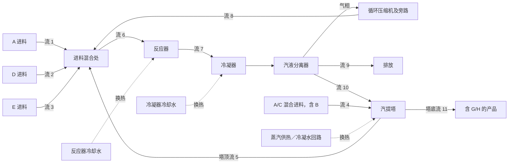

# TEP 工艺、变量与预设故障知识手册

本手册以余国源硕士论文第 2.4 节为基础，补充原始 TE 论文、仿真程序说明及数据集文档。用于回答“流程怎么连接”“变量代表什么”“某个预设故障扰动了什么”等问题。

这里记录的是工艺结构、测量定义和故障注入设定。某次故障最先出现在哪个测量变量上、沿什么路径传播、诊断算法把哪个变量排为根源，应在具体实验报告中给出数据与证据，不能从本手册的故障表直接读出。

**阅读路径：**先读第 2–4 节理解工艺，再用第 5 节查变量、第 7 节查故障。第 8 节保留资料冲突，第 9 节提供可追溯来源。配套《RAG 知识文档使用说明》介绍如何把本手册变成检索片段及验收问答。

## 1. 适用范围与术语｜SCOPE-001

- TE、TEP、Tennessee Eastman Process、田纳西伊斯曼过程：本文中指同一过程控制基准。
- 设备编号、物流编号、测量变量编号和故障编号是不同体系。“流 4”是物料通道，“X4”是该通道的进料流量记录，“IDV(4)”则是反应器冷却水入口温度扰动。
- `X1–X41 = XMEAS(1)–XMEAS(41)`；`X42–X52 = XMV(1)–XMV(11)`。Python 的列位置比 X 编号小 1。
- 原始模型有 12 个操纵变量；第 12 个是搅拌器转速。本项目的 52 列文件没有收录它，不能自行增加一个 X53 后假定与原文件一致。
- 原始故障表包含 IDV(1)–IDV(20)；本文另外记录参考数据版本中的 IDV(21)，并标明其版本来源。
- 图和物流编号采用经典 TE 版本。不同修订模型可能重编号、增加传感器、改变控制器；不能只凭“TEP”名称合并定义。

依据：[S01，§2.4、表 2-1/2-2](#src-s01)、[S02，图 1、表 3–5/8](#src-s02)、[S03，文件头接口说明](#src-s03)、[S04，File Format / Fault Scenarios](#src-s04)。

## 2. 组分与反应｜CHEM-001

### 2.1 八个组分的角色

| 组分 | 在基准模型中的角色 | 阅读边界 |
| --- | --- | --- |
| A | 反应物 | 存在于 A 进料和 A/C 混合进料中 |
| B | 惰性组分 | 不出现在下列四条反应的反应物或产物项中；不是催化剂名称 |
| C | 反应物 | 随流 4 的混合进料进入过程 |
| D | 反应物 | 由流 2 补充 |
| E | 反应物 | 由流 3 补充 |
| F | 副产物 | 由两条副反应产生 |
| G | 目标产品之一 | 随塔底产品流输出 |
| H | 目标产品之一 | 随塔底产品流输出 |

A–H 是基准模型的组分标识。本手册不把它们擅自对应为具体商业化学品。

### 2.2 四条反应

| 反应 ID | 反应式 | 类型 |
| --- | --- | --- |
| RXN-01 | A + C + D → G | 生成产品 G |
| RXN-02 | A + C + E → H | 生成产品 H |
| RXN-03 | A + E → F | 生成副产物 F |
| RXN-04 | 3D → 2F | 生成副产物 F |

原始描述将这些反应设为不可逆放热反应；温度进入反应速率关系。反应器中的非挥发性催化剂溶于液相并留在反应器内。**催化剂与惰性组分 B 应分别理解**；不要因二手图式箭头上的标注把 B 写成催化剂。

反应式可以说明原料消耗与产物生成的关系，不能单独确定闭环运行时某个传感器先升后降的时间序列。

依据：[S01，§2.4 反应式与组分描述](#src-s01)；催化剂与反应属性核对：[S02，pp.245、247](#src-s02)。

## 3. 工艺结构与文字流程｜PROC-001

### 3.1 从原料到产品，以及两条返回路径

TEP 的主设备为反应器、冷凝器、汽液分离器、循环压缩机和汽提塔。以下按物流讲解，**不是故障因果图**。

1. **原料补充与进料混合。**流 1 补充 A，流 2 补充 D，流 3 补充 E。这些原料与汽提塔顶返回的流 5、压缩机侧返回的循环流 8 汇合，形成流 6，进入反应器。流 6 是混合后的总进料，不能视为某一路新鲜原料。
2. **反应与移热。**反应器接收流 6，进行产品和副产物生成反应。内部冷却水回路承担移热。反应器物料通过流 7 离开并进入冷凝段；流 7 包含产品和未反应组分。
3. **冷却、冷凝与分相。**冷凝器先对反应器出料换热，使可凝组分形成液相。随后汽液分离器把气液两相分开。冷凝是热交换/相变环节，分离器是相分离及液体滞留环节，二者不可合并成一个变量名称。
4. **气相循环与排放。**分离器气相有两条去向：一部分经流 9 排出系统，另一部分经循环压缩机返回进料端，构成流 8。排放为循环系统提供物料出口；循环回收未反应组分。排放气并非只有 B 或 F，流 9 的分析仪记录 A–H 八个组分。
5. **液相汽提。**分离器液体由流 10 进入汽提塔。流 4 是含 A/C 的新鲜混合进料，它先进入汽提塔参与汽提，而不是从图上直接连到反应器。汽提塔还有蒸汽供热环节，塔顶物料通过流 5 返回反应器进料混合处。
6. **产品输出。**汽提塔底通过流 11 输出含 G/H 的产品混合物。它不是已经分成两路的纯 G、纯 H。后续产品精制不属于本基准的五个主设备。

这形成两条返回路径：**分离器气相 → 压缩机 → 进料混合处**，以及**分离器液相 → 汽提塔 → 塔顶返回进料混合处**。因此某条管线的结构上游，并不自动等同于统计诊断中的根源。

依据：[S01，图 2.3、§2.4](#src-s01)，对照 [S02，图 1、p.247](#src-s02)。设备和流股的文本连接为本手册依据上述图示整理。

### 3.2 可检索的简化结构图｜FLOW-001

图为结构简化重绘，省略仪表、泵、阀门细节和压缩机旁路的完整管路。虚线仅表达公用工程换热关系。准确的仪表位置请回查 [S01 图 2.3](#src-s01)或 [S02 图 1](#src-s02)；结构文本见下表，即使检索器不解析 Mermaid 也能使用。

### 3.3 物流连接字典｜STREAM-001

| 稳定 ID | 图中编号 | 上游 → 下游 | 物料及作用 | 本项目直接相关测量 |
| --- | --- | --- | --- | --- |
| STREAM-01 | 1 | A 原料边界 → 进料混合处 | A 新鲜进料 | X1 流量 |
| STREAM-02 | 2 | D 原料边界 → 进料混合处 | D 新鲜进料 | X2 流量 |
| STREAM-03 | 3 | E 原料边界 → 进料混合处 | E 新鲜进料 | X3 流量 |
| STREAM-04 | 4 | A/C 原料边界 → 汽提塔 | 含 A、C 和 B 的进料，参与汽提 | X4 总流量；没有流 4 组分/温度/总管压力直接记录 |
| STREAM-05 | 5 | 汽提塔顶 → 进料混合处 | 汽提塔顶返回物料 | 没有独立流量列 |
| STREAM-06 | 6 | 进料混合处 → 反应器 | 新鲜原料和返回物流形成的总进料 | X6 流量；X23–X28 的 A–F 组分 |
| STREAM-07 | 7 | 反应器 → 冷凝器 → 分离器 | 反应器出料在冷凝后送入分离器 | 没有流 7 独立流量/组分列 |
| STREAM-08 | 8 | 分离器气相经压缩机循环支路 → 进料混合处 | 循环气体 | X5 流量 |
| STREAM-09 | 9 | 分离器气相排放支路 → 系统外 | 排放气体 | X10 流量；X29–X36 的 A–H 组分 |
| STREAM-10 | 10 | 分离器液相 → 汽提塔 | 冷凝液及其中残余组分 | X14 体积流量 |
| STREAM-11 | 11 | 汽提塔底 → 基准边界外 | 含 G/H 的产品混合物 | X17 体积流量；X37–X41 的 D–H 组分 |
| UTILITY-12 | 12 | 冷却水公用工程 ↔ 反应器冷却束 | 换热介质，不是反应原料 | X21 出口温度；X51 操纵通道 |
| UTILITY-13 | 13 | 冷却水公用工程 ↔ 冷凝器 | 换热介质，不是反应器出料 | X22 出口温度；X52 操纵通道 |

12/13 采用经典图 1 的公用工程编号；部分修订模型另有编号。X51/X52 是操纵量，没有提供以 m³/h 表示的独立冷却水流量测量列。汽提蒸汽/冷凝水在图上单独标注，本表不擅自赋予新的物料流号。

依据：[S01，图 2.3、表 2-1](#src-s01)、[S02，图 1](#src-s02)、[S03，测量/操纵变量声明](#src-s03)。

## 4. 设备说明

### 4.1 反应器｜EQUIP-REACTOR

**功能与边界。**反应器是发生四条反应的设备，接收混合进料流 6，经流 7 向冷凝器排出物料。进料侧同时受到新鲜原料和循环物料的影响；仅看一条新鲜进料无法完整描述反应器入口组成。

**换热与内部操作。**反应放热，内部冷却束负责移热，搅拌器是原始模型的另一操纵对象。冷却水和反应物料隔着换热面交换热量，不能把冷却水入口当作进入反应器参与反应的进料。

**记录字段。**X6 为流 6 总流量；X7、X8、X9 分别是反应器压力、液位、温度。X21 是反应器冷却水出口温度；X51 是冷却水操纵通道。X23–X28 是入口流 6 的组分分析，并非反应器内部液相组分。搅拌器转速不在本项目 52 列中。

**与故障表的连接。**IDV(4)/(11) 改变冷却水入口温度，IDV(14) 对应冷却水阀粘滞，IDV(13) 改变反应动力学。这些物理位置相近但扰动类型不同；不能合并成“X9 温度故障”。

依据：[S01，§2.4、图 2.3、表 2-1/2-2](#src-s01)、[S02，p.247](#src-s02)、[S03，变量及扰动声明](#src-s03)。

### 4.2 冷凝器｜EQUIP-CONDENSER

**功能与边界。**冷凝器接收流 7 的反应器出料，通过冷却使可凝部分形成液体，之后送往汽液分离器。冷凝器负责换热，分离器负责把形成的气液两相分开。

**公用工程。**其冷却水属于独立换热侧。X52 对应冷凝器冷却水操纵量；X22 的原始测量名称为“Separator Cooling Water Outlet Temperature”，本文称为“分离器冷却水出口温度（对应冷凝冷却系统）”，保留原名以便核对。它不是汽提塔冷却水，也不是压缩机冷却水。

**记录局限。**52 列没有直接记录这一冷却水入口温度。IDV(5)/(12) 的扰动定义不能直接等同于 X22，因为入口温度与出口温度是不同物理量；IDV(15) 则是该冷却水阀门粘滞。

依据：[S01，图 2.3](#src-s01)、[S02，图 1、表 4](#src-s02)、[S03，XMEAS(22)、XMV(11)、IDV(5)/(12)/(15)](#src-s03)。

### 4.3 汽液分离器｜EQUIP-SEPARATOR

**功能与边界。**接收冷凝后的反应器出料，形成气相和液相出口。气相进入循环与排放两条支路；液相流 10 进入汽提塔。分离器中有液体存量，因此液位与液相流出量是两个不同量。

**记录字段。**X11 温度、X12 液位、X13 压力描述分离器状态，X14 记录流 10 流量，X48 是该液体排出操纵通道。流 9 的排放量是 X10，操纵通道是 X47，气体组分是 X29–X36。

**作用说明。**气相循环回收物料；气相排放为惰性组分和副产物等提供排出通道。分离器不是 G/H 的最终精制设备；流 10 还需进入汽提塔，不能称作最终产品。

依据：[S01，图 2.3、表 2-1](#src-s01)、[S02，p.247](#src-s02)、[S03，变量声明](#src-s03)。

### 4.4 循环压缩机｜EQUIP-COMPRESSOR

**功能与边界。**循环压缩机处理分离器未凝气相循环支路，使循环物流经流 8 返回进料侧。经典图中还画有压缩机旁路/回流阀，因此“压缩机循环阀”不能简单画成串在流 8 上的普通进料阀。

**记录字段。**X5 是流 8 循环流量，X20 是压缩机功率，X46 = XMV(5) 是压缩机循环阀操纵量。功率单位 kW，既不是压力，也不是累计耗电量 kWh。

**知识边界。**这些变量说明部件、测点和执行通道关系，不能据此预先规定 X46 增加时所有工况下 X5 都按同一方向变化。

依据：[S01，图 2.3、表 2-1](#src-s01)、[S02，图 1](#src-s02)、[S03，XMEAS(5)/(20)、XMV(5)](#src-s03)。

### 4.5 汽提塔｜EQUIP-STRIPPER

**功能与边界。**汽提塔接收分离器液相流 10，并使用流 4 的新鲜进料对其中残余反应物进行汽提。塔顶流 5 返回进料混合处，塔底流 11 输出产品混合物。流 4 虽常简称 C 进料，但其组分定义包含 A/C 混合物及 B。

**供热与产品。**汽提塔配置蒸汽供热及冷凝水侧。蒸汽是供热介质，不能与工艺产品物流合并。塔底产品含 G/H，后续把它们分离的精制系统不在 TE 基准内。

**记录字段。**X15、X16、X18 为塔液位、压力、温度；X17 为塔底流 11 的流量；X19 为蒸汽流量。X49 控制塔底产品排出，X50 为蒸汽阀操纵量。X37–X41 记录流 11 中 D/E/F/G/H 的摩尔百分数。

**常见混淆。**X22 不属于汽提塔；流 5 不是冷凝水；X37–X41 也不是“反应器组分”。

依据：[S01，图 2.3、表 2-1](#src-s01)、[S02，p.247、图 1](#src-s02)、[S03，变量声明](#src-s03)。

## 5. 完整变量字典｜VARS-001

本节复用论文表 2-1 的 X1–X52 顺序，补齐原始标识、单位和测点范围；有冲突的中文名称见第 8 节。每行的 `VAR-Xnn` 是知识条目 ID，便于稳定引用。

**单位约定：**kscmh 表示千标准立方米/小时；本手册未补造“标准状态”的温压定义。kPa(g) 为表压。mol% 为摩尔百分数，不能当作质量百分数。液位 % 是模型的液位标度，不保证等于容器总体积百分比。操纵量 % 是 XMV 的归一化设置，不能直接按 m³/h 或 kg/h 解释；也不代表独立传感器测得的真实阀芯位置。

变量表来源：[S01，表 2-1，印刷页 22](#src-s01)与 [S03，文件头三个变量区段](#src-s03)；XMV 归一化定义核对 [S02，表 3 下方说明](#src-s02)。

### 5.1 连续过程测量：X1–X22

| 条目 ID | 项目字段 | 原始标识 | 含义与测点 | 单位 |
| --- | --- | --- | --- | --- |
| VAR-X01 | X1 | XMEAS(1) | A 进料流量；流 1 | kscmh |
| VAR-X02 | X2 | XMEAS(2) | D 进料流量；流 2 | kg/h |
| VAR-X03 | X3 | XMEAS(3) | E 进料流量；流 3 | kg/h |
| VAR-X04 | X4 | XMEAS(4) | A/C 混合进料总流量；流 4 | kscmh |
| VAR-X05 | X5 | XMEAS(5) | 循环气流量；流 8 | kscmh |
| VAR-X06 | X6 | XMEAS(6) | 反应器总进料流量；流 6 | kscmh |
| VAR-X07 | X7 | XMEAS(7) | 反应器压力 | kPa(g) |
| VAR-X08 | X8 | XMEAS(8) | 反应器液位 | % |
| VAR-X09 | X9 | XMEAS(9) | 反应器温度 | °C |
| VAR-X10 | X10 | XMEAS(10) | 排放流量；流 9 | kscmh |
| VAR-X11 | X11 | XMEAS(11) | 汽液分离器温度 | °C |
| VAR-X12 | X12 | XMEAS(12) | 汽液分离器液位 | % |
| VAR-X13 | X13 | XMEAS(13) | 汽液分离器压力 | kPa(g) |
| VAR-X14 | X14 | XMEAS(14) | 分离器液相出口流量；流 10 | m³/h |
| VAR-X15 | X15 | XMEAS(15) | 汽提塔液位 | % |
| VAR-X16 | X16 | XMEAS(16) | 汽提塔压力 | kPa(g) |
| VAR-X17 | X17 | XMEAS(17) | 汽提塔底产品流量；流 11 | m³/h |
| VAR-X18 | X18 | XMEAS(18) | 汽提塔温度 | °C |
| VAR-X19 | X19 | XMEAS(19) | 汽提塔蒸汽流量 | kg/h |
| VAR-X20 | X20 | XMEAS(20) | 压缩机功率 | kW |
| VAR-X21 | X21 | XMEAS(21) | 反应器冷却水出口温度 | °C |
| VAR-X22 | X22 | XMEAS(22) | 分离器冷却水出口温度；对应冷凝冷却系统 | °C |

### 5.2 组分分析测量：X23–X41

同一组分在不同流股中有不同变量。例如 X24 与 X30 都测 B，前者在流 6，后者在流 9；它们不是可互换的别名。

| 条目 ID | 项目字段 | 原始标识 | 含义与测点 | 单位 |
| --- | --- | --- | --- | --- |
| VAR-X23 | X23 | XMEAS(23) | 反应器进料中 A；流 6 | mol% |
| VAR-X24 | X24 | XMEAS(24) | 反应器进料中 B；流 6 | mol% |
| VAR-X25 | X25 | XMEAS(25) | 反应器进料中 C；流 6 | mol% |
| VAR-X26 | X26 | XMEAS(26) | 反应器进料中 D；流 6 | mol% |
| VAR-X27 | X27 | XMEAS(27) | 反应器进料中 E；流 6 | mol% |
| VAR-X28 | X28 | XMEAS(28) | 反应器进料中 F；流 6 | mol% |
| VAR-X29 | X29 | XMEAS(29) | 排放气中 A；流 9 | mol% |
| VAR-X30 | X30 | XMEAS(30) | 排放气中 B；流 9 | mol% |
| VAR-X31 | X31 | XMEAS(31) | 排放气中 C；流 9 | mol% |
| VAR-X32 | X32 | XMEAS(32) | 排放气中 D；流 9 | mol% |
| VAR-X33 | X33 | XMEAS(33) | 排放气中 E；流 9 | mol% |
| VAR-X34 | X34 | XMEAS(34) | 排放气中 F；流 9 | mol% |
| VAR-X35 | X35 | XMEAS(35) | 排放气中 G；流 9 | mol% |
| VAR-X36 | X36 | XMEAS(36) | 排放气中 H；流 9 | mol% |
| VAR-X37 | X37 | XMEAS(37) | 塔底产品中 D；流 11 | mol% |
| VAR-X38 | X38 | XMEAS(38) | 塔底产品中 E；流 11 | mol% |
| VAR-X39 | X39 | XMEAS(39) | 塔底产品中 F；流 11 | mol% |
| VAR-X40 | X40 | XMEAS(40) | 塔底产品中 G；流 11 | mol% |
| VAR-X41 | X41 | XMEAS(41) | 塔底产品中 H；流 11 | mol% |

### 5.3 操纵变量：X42–X52

| 条目 ID | 项目字段 | 原始标识 | 含义与作用对象 | 单位 |
| --- | --- | --- | --- | --- |
| VAR-X42 | X42 | XMV(1) | D 进料操纵量；流 2 | %（归一化设置） |
| VAR-X43 | X43 | XMV(2) | E 进料操纵量；流 3 | %（归一化设置） |
| VAR-X44 | X44 | XMV(3) | A 进料操纵量；流 1 | %（归一化设置） |
| VAR-X45 | X45 | XMV(4) | A/C 进料操纵量；流 4 | %（归一化设置） |
| VAR-X46 | X46 | XMV(5) | 压缩机循环／旁路阀操纵量 | %（归一化设置） |
| VAR-X47 | X47 | XMV(6) | 排放阀操纵量；流 9 | %（归一化设置） |
| VAR-X48 | X48 | XMV(7) | 分离器液相排出操纵量；流 10 | %（归一化设置） |
| VAR-X49 | X49 | XMV(8) | 汽提塔底产品排出操纵量；流 11 | %（归一化设置） |
| VAR-X50 | X50 | XMV(9) | 汽提塔蒸汽阀操纵量 | %（归一化设置） |
| VAR-X51 | X51 | XMV(10) | 反应器冷却水操纵量 | %（归一化设置） |
| VAR-X52 | X52 | XMV(11) | 冷凝器冷却水操纵量 | %（归一化设置） |

原始模型允许传入超出 0–100 的 XMV 值，但内部作用值会被约束。因此 0–100 是规定的操纵范围，不能仅凭文件中某个原始 XMV 超界就断言文件损坏；应核对生成器是否输出了限幅前的命令。[S02，表 3 说明](#src-s02)

## 6. 时间、采样和数据解释｜DATA-001

### 6.1 文件记录间隔与分析仪延迟

| 数据对象 | 对应字段 | 原始模型的更新周期 | 分析延迟 | 本项目如何理解 |
| --- | --- | --- | --- | --- |
| 连续过程测量 | X1–X22 | 随仿真过程计算 | 本表不额外指定分析延迟 | 数据文件仍按保存间隔记录 |
| 流 6 组分分析 | X23–X28 | 6 分钟 | 6 分钟 | 刚获得的读数对应更早取得的样品 |
| 流 9 组分分析 | X29–X36 | 6 分钟 | 6 分钟 | 不能当成每 3 分钟都有一个新样品 |
| 流 11 组分分析 | X37–X41 | 15 分钟 | 15 分钟 | 可能连续多行维持同一组分读数 |
| 参考测试文件的保存 | 一整行 52 列 | 3 分钟 | 不等于各测点延迟 | 一行同时保存不代表测点同步采样 |

原始说明以 0.1 h / 0.25 h 表达分析仪周期及延迟。**3 分钟是文件记录间隔，不是所有传感器的真实刷新周期。**这个区别对后续时滞选择、格兰杰分析及“谁先变化”的解释有直接影响。

依据：[S03，Sampled Process Measurements](#src-s03)、[S04，File Format](#src-s04)。最后一句是本项目的方法使用注意事项，不是预设故障传播结论。

### 6.2 当前项目数据范围

当前已使用正常工况 `d00_te.dat` 和故障 7 的 `d07_te.dat`。本地检查结果均为 960 行、52 列，没有缺失值或无穷值；这只适用于当前两个文件，不代表全部 TEP 数据都没有异常值。

论文实验约定为每 3 分钟记录一次、48 小时测试、8 小时后注入故障；当前项目据此前 160 点为正常段，后续段作故障分析。该约定不能自动推广到其他仿真器、训练文件或重新生成的数据，换文件时需重新核对时间轴和注入点。

本地数据的下载地址、文件哈希及首次检查见 [data/README.md](data/README.md)。这里的故障目录覆盖 21 类，**不代表当前诊断功能已对 21 类逐一验证**。

依据：[S01，§2.4 的实验数据说明](#src-s01)、[S04，文件结构说明](#src-s04)、本项目数据检查记录。

### 6.3 数据清洗时不要误删的现象｜DATA-002

以下是依据测量定义制定的检查规则，不是所有 TEP 文件都已出现的异常：

- 组分分析值重复：先检查分析仪保持和刷新机制，再决定是否为冻结测点；不能默认删除重复行。
- 故障附近的突变：与故障设定、时间窗对照，不能把需要诊断的变化先当离群点抹除。
- 不同量纲：流量、温度、压力、百分数不能直接比较绝对幅度；归一化参数应记录其拟合数据范围。
- 组分和不等于 100%：流 6 仅列 A–F，流 11 仅列 D–H，二者不是完整八组分列表；不能强行把每组归一到 100%。流 9 虽列八组分，也需考虑测量噪声与数值精度。
- 缺失、非有限值、列数或列顺序改变：应独立报告，不应通过静默补零让诊断继续。
- 进料或冷却水入口温度未测：不能把“没有这一列”处理为“这一列数值为零”。

## 7. 预设故障目录与可观测边界｜FAULTS-001

本节的“故障根源”仅指仿真设定中被改变的物理量或部件。**注入量、测量量、操纵命令、诊断结果四者必须分开。**关联字段用于把描述连到变量字典，不表示这些字段必然异常或按列举顺序传播。

IDV(1)–(20) 的定义依据 [S01 表 2-2](#src-s01)、[S03 Process Disturbances](#src-s03)，按原始代码纠正流股编号；IDV(21) 单独依据 [S04 Fault Scenarios](#src-s04)。每条保留完整限定，便于后续独立切片。

### 7.1 IDV(1)：流 4 的 A/C 比例变化｜FAULT-IDV01

- **扰动类型：**阶跃。
- **预设注入：**流 4 的 A/C 比例改变，B 组分保持不变。
- **可观测性：**无直接记录：52 列不含流 4 的 A/C 比例。
- **关联字段：**X4 是流 4 总流量；X23、X25 是下游流 6 的 A、C 组分。
- **解释边界：**流 6 的组分不能直接改名为流 4 的注入组分。
- **来源：**[S03，Process Disturbances 的 IDV(1)](#src-s03)；中文对照 [S01，表 2-2](#src-s01)。

### 7.2 IDV(2)：流 4 的 B 组分变化｜FAULT-IDV02

- **扰动类型：**阶跃。
- **预设注入：**流 4 的 B 组分改变，A/C 比例保持不变。
- **可观测性：**无直接记录：52 列不含流 4 的 B 组分。
- **关联字段：**X24 是下游流 6 的 B，X30 是排放流 9 的 B。
- **解释边界：**不能把 X24 或 X30 固定标为本故障的标准根源。
- **来源：**[S03，Process Disturbances 的 IDV(2)](#src-s03)；中文对照 [S01，表 2-2](#src-s01)。

### 7.3 IDV(3)：D 进料温度变化｜FAULT-IDV03

- **扰动类型：**阶跃。
- **预设注入：**流 2 的 D 进料温度改变。
- **可观测性：**无直接记录：流 2 温度不在 52 列中。
- **关联字段：**X2 是流 2 流量，X42 是 D 进料操纵量。
- **解释边界：**X2 测流量，不测温度；此处是流 2。
- **来源：**[S03，Process Disturbances 的 IDV(3)](#src-s03)；中文对照 [S01，表 2-2](#src-s01)。

### 7.4 IDV(4)：反应器冷却水入口温度变化｜FAULT-IDV04

- **扰动类型：**阶跃。
- **预设注入：**反应器冷却水入口温度改变。
- **可观测性：**无直接记录：入口温度不在 52 列中。
- **关联字段：**X21 为冷却水出口温度，X51 为冷却水操纵量；X9 为反应器温度。
- **解释边界：**不能把出口温度 X21 当作入口温度的同义字段。
- **来源：**[S03，Process Disturbances 的 IDV(4)](#src-s03)；中文对照 [S01，表 2-2](#src-s01)。

### 7.5 IDV(5)：冷凝器冷却水入口温度变化｜FAULT-IDV05

- **扰动类型：**阶跃。
- **预设注入：**冷凝器冷却水入口温度改变。
- **可观测性：**无直接记录：入口温度不在 52 列中。
- **关联字段：**X22 为相应冷却水出口温度，X52 为冷却水操纵量；X11 为分离器温度。
- **解释边界：**本故障是入口温度扰动，不是阀门粘滞。
- **来源：**[S03，Process Disturbances 的 IDV(5)](#src-s03)；中文对照 [S01，表 2-2](#src-s01)。

### 7.6 IDV(6)：A 进料损失｜FAULT-IDV06

- **扰动类型：**阶跃。
- **预设注入：**流 1 的 A 进料供应损失。
- **可观测性：**X1 直接记录受影响的流 1 流量；供应损失原因未由独立传感器记录。
- **关联字段：**X44 为 A 进料操纵量。
- **解释边界：**进料损失不等于已证明阀门损坏。
- **来源：**[S03，Process Disturbances 的 IDV(6)](#src-s03)；中文对照 [S01，表 2-2](#src-s01)。

### 7.7 IDV(7)：C 进料总管压力损失｜FAULT-IDV07

- **扰动类型：**阶跃。
- **预设注入：**流 4 的进料总管压力下降，供料可用性降低。
- **可观测性：**无直接记录：52 列没有该总管压力。
- **关联字段：**X4 为流 4 流量，X45 为流 4 进料操纵量。
- **解释边界：**X4 不是压力；流 4 不应按简称 C 进料理解为纯 C。
- **来源：**[S03，Process Disturbances 的 IDV(7)](#src-s03)；中文对照 [S01，表 2-2](#src-s01)。

### 7.8 IDV(8)：流 4 的 A/B/C 组分随机变化｜FAULT-IDV08

- **扰动类型：**随机变化。
- **预设注入：**流 4 的 A、B、C 进料组分发生随机变化。
- **可观测性：**无直接记录：流 4 组分不在 52 列中。
- **关联字段：**X23–X25 为下游流 6 的 A、B、C 组分。
- **解释边界：**不能把随机组分扰动简化为一个固定 X 编号。
- **来源：**[S03，Process Disturbances 的 IDV(8)](#src-s03)；中文对照 [S01，表 2-2](#src-s01)。

### 7.9 IDV(9)：D 进料温度随机变化｜FAULT-IDV09

- **扰动类型：**随机变化。
- **预设注入：**流 2 的 D 进料温度随机变化。
- **可观测性：**无直接记录：流 2 温度不在 52 列中。
- **关联字段：**X2 为流 2 流量；X42 为 D 进料操纵量。
- **解释边界：**与 IDV(3) 的作用量相同，时间变化类型不同。
- **来源：**[S03，Process Disturbances 的 IDV(9)](#src-s03)；中文对照 [S01，表 2-2](#src-s01)。

### 7.10 IDV(10)：C 进料温度随机变化｜FAULT-IDV10

- **扰动类型：**随机变化。
- **预设注入：**流 4 的进料温度随机变化，原始名称为 C Feed Temperature。
- **可观测性：**无直接记录：流 4 进料温度不在 52 列中。
- **关联字段：**X4 为流 4 流量；X45 为流 4 进料操纵量。
- **解释边界：**按原始代码采用流 4；论文表中的流 2 已登记为来源冲突。
- **来源：**[S03，Process Disturbances 的 IDV(10)](#src-s03)；中文对照 [S01，表 2-2](#src-s01)。

### 7.11 IDV(11)：反应器冷却水入口温度随机变化｜FAULT-IDV11

- **扰动类型：**随机变化。
- **预设注入：**反应器冷却水入口温度随机变化。
- **可观测性：**无直接记录：入口温度不在 52 列中。
- **关联字段：**X21 为出口温度，X51 为操纵量；X9 为反应器温度。
- **解释边界：**与 IDV(4) 不同之处在扰动随时间的形式。
- **来源：**[S03，Process Disturbances 的 IDV(11)](#src-s03)；中文对照 [S01，表 2-2](#src-s01)。

### 7.12 IDV(12)：冷凝器冷却水入口温度随机变化｜FAULT-IDV12

- **扰动类型：**随机变化。
- **预设注入：**冷凝器冷却水入口温度随机变化。
- **可观测性：**无直接记录：入口温度不在 52 列中。
- **关联字段：**X22 为出口温度，X52 为操纵量；X11 为分离器温度。
- **解释边界：**不能将入口温度扰动等同于 X52 阀门故障。
- **来源：**[S03，Process Disturbances 的 IDV(12)](#src-s03)；中文对照 [S01，表 2-2](#src-s01)。

### 7.13 IDV(13)：反应动力学漂移｜FAULT-IDV13

- **扰动类型：**缓慢漂移。
- **预设注入：**反应动力学发生缓慢变化。
- **可观测性：**无直接记录：动力学参数不在 52 列中。
- **关联字段：**可按反应器及组分分析字段组织后续诊断，但没有预设单一根源列。
- **解释边界：**本目录不补造具体反应速率常数、变化幅度或传播路径。
- **来源：**[S03，Process Disturbances 的 IDV(13)](#src-s03)；中文对照 [S01，表 2-2](#src-s01)。

### 7.14 IDV(14)：反应器冷却水阀门粘滞｜FAULT-IDV14

- **扰动类型：**阀门粘滞。
- **预设注入：**反应器冷却水阀门出现粘滞。
- **可观测性：**X51 = XMV(10) 是对应操纵通道；并非另有一个实际阀位测量。
- **关联字段：**X21 为冷却水出口温度，X9 为反应器温度。
- **解释边界：**命令变化不证明实际阀门已经跟随。
- **来源：**[S03，Process Disturbances 的 IDV(14)](#src-s03)；中文对照 [S01，表 2-2](#src-s01)。

### 7.15 IDV(15)：冷凝器冷却水阀门粘滞｜FAULT-IDV15

- **扰动类型：**阀门粘滞。
- **预设注入：**冷凝器冷却水阀门出现粘滞。
- **可观测性：**X52 = XMV(11) 是对应操纵通道；并非另有一个实际阀位测量。
- **关联字段：**X22 为冷却水出口温度，X11 为分离器温度。
- **解释边界：**不能把本故障改写为压缩机冷却水阀故障。
- **来源：**[S03，Process Disturbances 的 IDV(15)](#src-s03)；中文对照 [S01，表 2-2](#src-s01)。

### 7.16 IDV(16)：未公开定义的预设故障 16｜FAULT-IDV16

- **扰动类型：**Unknown。
- **预设注入：**原始故障清单将本项标为 Unknown；本版本没有经核实的具体物理定义。
- **可观测性：**无法建立已确认的注入量—X 字段映射。
- **关联字段：**保留故障编号供检索和实验索引；不指定根源 X。
- **解释边界：**未知定义不表示没有故障，也不表示算法不能分析；推测必须作为实验结论另行保存。
- **来源：**[S03，Process Disturbances 的 IDV(16)](#src-s03)；中文对照 [S01，表 2-2](#src-s01)。

### 7.17 IDV(17)：未公开定义的预设故障 17｜FAULT-IDV17

- **扰动类型：**Unknown。
- **预设注入：**原始故障清单将本项标为 Unknown；本版本没有经核实的具体物理定义。
- **可观测性：**无法建立已确认的注入量—X 字段映射。
- **关联字段：**保留故障编号供检索和实验索引；不指定根源 X。
- **解释边界：**未知定义不表示没有故障，也不表示算法不能分析；推测必须作为实验结论另行保存。
- **来源：**[S03，Process Disturbances 的 IDV(17)](#src-s03)；中文对照 [S01，表 2-2](#src-s01)。

### 7.18 IDV(18)：未公开定义的预设故障 18｜FAULT-IDV18

- **扰动类型：**Unknown。
- **预设注入：**原始故障清单将本项标为 Unknown；本版本没有经核实的具体物理定义。
- **可观测性：**无法建立已确认的注入量—X 字段映射。
- **关联字段：**保留故障编号供检索和实验索引；不指定根源 X。
- **解释边界：**未知定义不表示没有故障，也不表示算法不能分析；推测必须作为实验结论另行保存。
- **来源：**[S03，Process Disturbances 的 IDV(18)](#src-s03)；中文对照 [S01，表 2-2](#src-s01)。

### 7.19 IDV(19)：未公开定义的预设故障 19｜FAULT-IDV19

- **扰动类型：**Unknown。
- **预设注入：**原始故障清单将本项标为 Unknown；本版本没有经核实的具体物理定义。
- **可观测性：**无法建立已确认的注入量—X 字段映射。
- **关联字段：**保留故障编号供检索和实验索引；不指定根源 X。
- **解释边界：**未知定义不表示没有故障，也不表示算法不能分析；推测必须作为实验结论另行保存。
- **来源：**[S03，Process Disturbances 的 IDV(19)](#src-s03)；中文对照 [S01，表 2-2](#src-s01)。

### 7.20 IDV(20)：未公开定义的预设故障 20｜FAULT-IDV20

- **扰动类型：**Unknown。
- **预设注入：**原始故障清单将本项标为 Unknown；本版本没有经核实的具体物理定义。
- **可观测性：**无法建立已确认的注入量—X 字段映射。
- **关联字段：**保留故障编号供检索和实验索引；不指定根源 X。
- **解释边界：**未知定义不表示没有故障，也不表示算法不能分析；推测必须作为实验结论另行保存。
- **来源：**[S03，Process Disturbances 的 IDV(20)](#src-s03)；中文对照 [S01，表 2-2](#src-s01)。

### 7.21 IDV(21)：流 4 阀门位置固定｜FAULT-IDV21

- **扰动类型：**固定阀位（参考数据扩展）。
- **预设注入：**后续参考数据将本项定义为流 4 阀门位置保持常数。
- **可观测性：**X45 = XMV(4) 是对应进料操纵通道；X4 记录流 4 流量。
- **关联字段：**需结合具体生成器区分阀位固定值、控制命令和实际执行值。
- **解释边界：**不属于原始 1993 年 IDV(1)–(20) 表；固定阀位与 IDV(14)/(15) 的粘滞不能直接混用。
- **来源：**[S04，Fault Scenarios 的 d21](#src-s04)。

## 8. 来源冲突、修订决定与未知项｜CONFLICT-001

这里保留本次核对发现的差异；后续回答涉及这些争议点时，应能回溯采用了哪个版本。

| ID | 问题 | 本手册采用的表述 | 核对依据与状态 |
| --- | --- | --- | --- |
| C01 | 论文表 2-1 将 X22 写成汽提塔冷却水出口温度 | 分离器冷却水出口温度，对应冷凝冷却系统 | S03 的 XMEAS(22)，S02 表 4；已记录纠正 |
| C02 | 论文表 2-1 将 X52 写成压缩机冷却水流量 | 冷凝器冷却水操纵量 XMV(11) | S03 的 XMV(11)；已记录纠正 |
| C03 | 论文表 2-2 的 IDV(10) 写流 2 | 流 4 进料温度随机变化 | S03 的 IDV(10)，S04 的 d10；已记录纠正 |
| C04 | 论文正文统称 IDV(16)–(21) 未知，但表中定义了 21 | IDV(16)–(20) 为 Unknown；21 按扩展数据说明 | S01 表 2-2、S03、S04；按版本拆分 |
| C05 | Ricker 网页将 IDV(3) 一处写成 stream 3 | D 进料温度，流 2 | S03 的 IDV(3)、S01 表 2-2；保留网页错误记录 |
| C06 | 论文反应式箭头上的 B 标注可能被误读为催化剂 | B 是惰性组分；催化剂另行描述 | S02 pp.245、247；不继承有歧义的箭头标注 |
| C07 | 原模型有 12 个 XMV，数据只有 52 列 | 41 个 XMEAS + 前 11 个 XMV；搅拌器未收录 | S03、S04；数据模式差异，不是缺失一行字典 |
| C08 | 部分修订结构模型将反应器出料编号为 13 | 本文经典图中反应器出料为 7，13 是冷凝冷却水侧编号 | S02 图 1；S06 只作版本差异线索，不混用编号 |
| C09 | “所有测点每 3 分钟采样”的表述过度简化 | 文件每 3 分钟保存，组分分析有 6/15 分钟周期与延迟 | S03、S04；已补充时间语义 |
| C10 | 原论文称部分后续扰动需配合其他扰动使用；代码说明已修订 | 本手册不沿用必须组合运行的限制 | S03 文件头 Differences 第 3 项；具体运行仍以生成器为准 |

**当前保留的未知：**IDV(16)–(20) 的可靠物理解释；当前数据生成器完整控制回路及参数是否与其他公开版本一致；未测入口量的真实时间曲线；全部 21 类诊断结果；各故障的可信动态传播路径。这些内容不能靠语言模型补齐。

**不纳入本版的内容：**各操作模式的全套稳态表、设备尺寸/物性常数、控制器整定和全套停机阈值。它们适合后续仿真或控制问答专题，不能从当前两份样本数据推断。若用户问到，应检索相应原始章节后再建立独立、带版本的条目。

## 9. 来源登记

资料核对日期：2026-09-26。条目中的 S 编号对应以下来源；文末链接便于核查，实际入库时应把来源定位一并写入片段元数据，不能只留下孤立的 “[S03]”。本手册的中文说明为整理改写，不是对论文全文的转载。

### S01｜用户硕士论文

余国源：《面向工业需求的改进格兰杰故障根源诊断方法研究》，上海大学，2024，送审版。重点为 §2.4，印刷页 20–23（PDF 第 32–35 页）；图 2.3 在印刷页 21，表 2-1 在 22，表 2-2 在 23。

[打开本地论文](</Users/rowen/Desktop/rowenList/个人信息/研究生课题和项目/论文/毕业论文余国源-送审版.pdf>)。

SHA-256：`6436726e0a7c3cc69daea65100d357a792c16b5dfaeae234ae67a7f5eadc1b7f`。

用途：本项目中文领域资料的主体；变量顺序、工艺图和故障清单。该论文中的诊断实验结果不作为所有工况的通用知识。

### S02｜原始 TE 论文

J. J. Downs & E. F. Vogel. *A plant-wide industrial process control problem*. Computers & Chemical Engineering, 17(3), 245–255, 1993. DOI：10.1016/0098-1354(93)80018-I。

[期刊 DOI](https://doi.org/10.1016/0098-1354(93)80018-I) · [大学站点全文](https://users.abo.fi/~khaggblo/RS/Downs.pdf)。

定位：反应描述 p.245；图 1 p.246；工艺文字 p.247；操纵变量表 3 p.248；测量表 4/5 p.249；故障表 8 p.250。页码为期刊印刷页，不是 PDF 页序。

用途：经典流程和术语的原始核对依据。当前下载文件的校验值另存于来源清单；网页可用性与期刊访问权限可能变化。

### S03｜经典仿真程序及接口说明

Downs / Vogel 原始 `teprob.f`，由 Braatz 数据公开镜像提供，文件头注明 1991-04-04 修正操纵变量说明顺序。

[固定版本 teprob.f](https://github.com/camaramm/tennessee-eastman-profBraatz/blob/0643318858ce7c87292bd59820b459e12a13d009/teprob.f)。

定位：文件头 `Manipulated Variables`、`Continuous Process Measurements`、`Sampled Process Measurements`、`Process Disturbances` 及 `Differences between the code and its description in the paper`。提交：`0643318858ce7c87292bd59820b459e12a13d009`。

用途：变量编号/单位、分析仪延迟、IDV(1)–(20) 的接口定义。该镜像的维护者与代码原作者不同，已在此区分。

### S04｜参考数据版本说明

[参考数据 README（固定版本）](https://github.com/jkitchin/tennessee-eastman-profbraatz/blob/9a6c8e5fcef4a2850778704e7793c87b0a187005/data/README.md)。提交：`9a6c8e5fcef4a2850778704e7793c87b0a187005`。

定位：`File Format`、`Fault Scenarios`。这是参考数据维护分支的说明，尤其用于标识 IDV(21)；不能把其中 21 类清单称为 1993 年原论文表 8。

本项目实际样本来自 [camaramm 的 Braatz 数据镜像](https://github.com/camaramm/tennessee-eastman-profBraatz)，文件级来源已登记于 [data/README.md](data/README.md)。

### S05｜Ricker 的 TE 档案

N. Lawrence Ricker，华盛顿大学：[Tennessee Eastman Challenge Archive](https://depts.washington.edu/control/LARRY/TE/download.html)。

定位：`Updated TE Code`、`Basic TEC Code`、`Decentralized control`。用于追溯模型版本与原始代码发布线索；其中 IDV(3) 的流股笔误按 C05 处理。

### S06｜修订结构模型（仅用于版本差异说明）

[TE Structural Model，附录 A](https://zenodo.org/records/5171645/files/TE_Structural_Model_Vs00.pdf)。部分结构/流股命名与经典图不同；本版没有将其编号写入经典变量和故障定义。

## 10. 本版交付状态

本次已整理：五个主设备、11 条物料流与两条编号冷却水回路、8 个组分、4 条反应、52 个数据字段、21 个故障条目、测量时间语义和 10 条差异记录。

本版是**可供复核和入库加工的知识文档成品**。它已做来源交叉核对，但尚未获得领域人员审核，也尚未完成分块、索引、检索测试和在线回答验收；不能据此宣称 RAG 已达到生产验收要求。

更改记录：v1.0.0（2026-09-26）由来源映射草案扩展为本手册；旧稿保留于 `docs/archive/TEP_SOURCE_MAP.before-v1.md`，归档文件不应参与默认检索。
