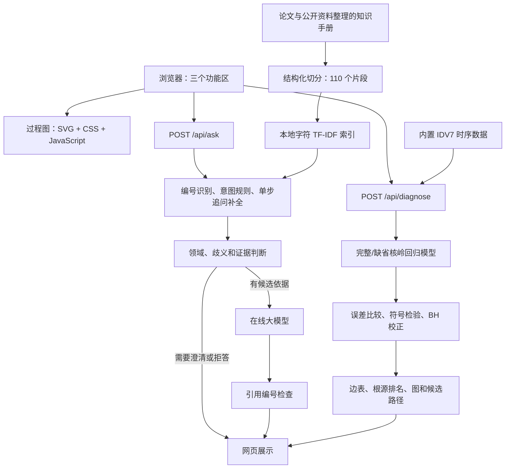

# TEP 故障助手：技术实现、项目复盘与面试手册

核对日期：2026-09-29。适用对象：当前本地网页版本。本文依据项目实际代码、知识库产物和验收记录编写。

本文的目标是让你能做到三件事：**讲清项目，沿代码查明问题，独立完成一次小修改并验证结果。**

建议阅读顺序：先读第 1–3 节建立整体认识，再读三个功能的实现，最后做第 11 节的练习。面试前复习第 9 节，并按第 10 节演示。技术术语不必背定义，要能用本项目的例子解释。

## 1. 用一分钟介绍这个项目

> 我将自己的 TEP 故障诊断研究整理成了一个可交互的网页产品，提供过程介绍、专业知识问答和故障根源诊断三个功能。过程介绍用 SVG 和八秒循环动画展示设备与物料流向；知识问答将论文和公开资料整理为可追溯的知识手册，切分成 110 个片段，通过文本检索、编号识别和有限追问补全获取依据，再由在线大模型生成带引用的回答；诊断使用核岭回归比较完整模型和去掉某个变量历史后的模型，筛选格兰杰因果关系，再生成候选根源变量、关系图和传播路径。三个功能通过设备和变量入口连接起来。

这段介绍对应当前实现。两个需要主动说清的边界：

- 当前是本地单用户研究演示产品，尚未做企业级多用户部署和运维验证。
- 诊断输出是选定变量、窗口和模型条件下的格兰杰预测关系，以及据此得到的候选根源、候选路径。它为物理机理分析提供线索。

### 三个功能分别解决什么问题

| 功能 | 用户输入 | 系统输出 | 在线大模型参与位置 |
| --- | --- | --- | --- |
| TEP 过程介绍 | 点击设备、播放/暂停、放大 | 设备结构、流向动画、设备说明 | 无 |
| TEP Agent 智能助手 | 领域问题和上一条已明确的问题 | 回答、引用片段；或澄清/拒答 | 检索之后，根据参考资料组织答案 |
| 故障根源诊断 | 故障后采样点数、滞后阶数 | 候选变量、关系矩阵、因果图、候选传播路径 | 无 |

页面主线是：**了解过程 → 查询知识 → 分析数据 → 对照工艺解释结果**。点击设备或候选变量可以填入问答框，用户确认发送后才调用模型。

## 2. 系统是怎样组成的



浏览器负责交互；Python 服务接收请求、组织流程；大模型服务只接收问答所需的问题和参考片段。浏览器直接访问本机 Python 服务，模型密钥由 Python 服务使用。

当前界面名称中使用了 Agent，但技术上是**有固定步骤的领域助手应用**。它还没有让大模型自行规划任务、选择诊断工具、循环调用工具再检查结果。面试中应把“产品名称”和“自主 Agent 架构”分清。

### 技术栈及其实际用途

| 技术 | 在项目里的用途 | 你应该能解释的内容 |
| --- | --- | --- |
| Python 标准库 `http.server` | `ThreadingHTTPServer` 提供本地页面和接口 | 请求怎样进入处理函数；并发线程不等于生产级并发能力 |
| HTML / CSS / 原生 JavaScript | 布局、聊天、表单、状态、路径联动 | `fetch`、DOM、事件委托和页面局部更新 |
| SVG | 工艺结构图、诊断关系图、矩阵 | 节点和连线可独立控制，放大仍清晰 |
| CSS keyframes | 八秒工艺动画、设备高亮 | 同一时钟如何控制不同管段的运动 |
| pandas / NumPy | 读取数据、选列、窗口构建、数值处理 | 时间顺序、列映射、数组维度 |
| scikit-learn `TfidfVectorizer` | 字符级文本检索向量 | 字符 n-gram、TF-IDF、余弦相似度 |
| scikit-learn `KernelRidge` / `StandardScaler` | 核岭回归和训练段标准化 | 完整/缺省模型、RBF 核、数据泄漏 |
| SciPy | 稀疏矩阵保存、二项检验 | 符号检验的统计对象与限制 |
| JSON / JSONL / NPZ | 配置、知识片段、稀疏索引、结果 | 不同格式各自存什么；版本与指纹如何校验 |
| HTTP 聊天接口 | 请求百炼兼容聊天服务 | 服务端认证、超时、响应解析、错误处理 |
| `unittest` | 自动回归检查 | 测什么、不能证明什么 |

当前没有引入 React、Vue、FastAPI、LangChain、语义 embedding 服务、向量数据库或神经网络重排模型。项目的运行依赖见 [requirements.txt](../requirements.txt)。当前图形直接生成 SVG，运行流程没有使用 Matplotlib 绘图。

## 3. 从研究原型到网页产品：制作过程复盘

开发顺序与网页展示顺序不同。项目先做出可运行的诊断，再完善问答，最后统一交互和过程展示。

| 阶段 | 当时解决的问题 | 形成的实现 |
| --- | --- | --- |
| 诊断初版 | 先把小样本方法跑通 | 直接使用第三方 `KernelRidge`，建立完整/缺省模型比较流程 |
| 问答接入 | 让用户能查询 TEP 知识 | 服务端在线模型调用、本地密钥保存、聊天窗口 |
| 知识库重建 | 原九张知识卡片缺少流程、变量和故障背景 | 整理知识手册、来源登记、变量字典、故障边界 |
| 切分与检索 | 验证什么资料应该被找出来 | 110 个片段、TF-IDF 基线、检索评测 |
| 问题理解 | 处理编号混淆和“那15呢”这类追问 | 编号/意图规则、保守的单步追问补全 |
| 诊断可视化 | 让算法输出可阅读、可核对 | 矩阵、关系图、候选路径、点击高亮 |
| 产品整合 | 让用户按顺序理解和操作 | 三个功能区、工艺动画、统一文案、折叠计算依据 |

这里最值得讲的工程思路是：**先获得一个可运行的最小流程，再用失败案例定位问题，逐层改进。** 例如“X4 是压力传感器吗”需要纠正错误前提，问题可能出在知识定义、检索排序或模型回答中的任一层，不能只靠不断改提示词。

## 4. 功能一：TEP 过程介绍与动画

TEP是Tennessee Eastman Process（田纳西伊斯曼过程）的缩写。按项目现有来源登记与页面介绍，它由Eastman Chemical公司的J. J. Downs和E. F. Vogel提出，详细论文发表于1993年，作为全流程工业过程控制研究的基准模型。它模拟反应、冷凝、分离、循环与汽提，将反应物转化为以G/H表示的产品组分；公开基准使用组分代号，不宜自行补成某种具体商品生产线。原论文书目信息见[知识手册的来源记录](../TEP_SOURCE_MAP.md)。

### 4.1 从原工艺图到网页图

原论文工艺图包含设备、仪表、控制信号和管线。网页导览先保留五个主设备、主要物料连接以及两条返回路径，再用设备说明补充含义。

绘制时先确认连接，再调整布局：

1. A、D、E 三路新鲜进料与流5、流8返回物料汇合，经流6进入反应器。
2. 反应器出料经流7进入冷凝器，再进入汽液分离器。
3. 分离器气相分出排放支路和压缩机循环支路。
4. 分离器液相经流10进入汽提塔；流4新鲜 A/C 混合进料也进入汽提塔。
5. 塔顶流5返回进料汇合处，塔底流11输出含 G/H 的产品混合物。

图中带编号的管线统一使用“流6（混合进料）”的表达。交叉处的小拱桥表示管线相交但不连通；共同节点才表示汇合。汽液分离器名称处使用不透明背景片，给竖直管线留出文字空隙。

**注意：这是简化结构导览。** 图中省略了仪表、泵阀和压缩机旁路，不能拿它替代详细工程图。G/H 是基准模型里的组分代号，知识库没有把它们对应到具体商品名称。

### 4.2 为什么使用 SVG

SVG 的设备、文字、箭头都在网页 DOM 中。可以给某台设备绑定点击事件、只改变某条管线透明度，也可以在放大时保持清晰。

实现分为两个文件：

- [process_layout.py](../process_layout.py)：设备形状、管线路径、坐标、编号和文字。
- [process_diagram.py](../process_diagram.py)：说明内容、动画时序、样式和交互。

路径中 `M` 表示移动到起点，`H/V` 表示水平/竖直线，`Q` 表示二次贝塞尔曲线，用于圆角和跨线拱桥。它们描述的是屏幕坐标；连接方向依据工艺定义确定。

### 4.3 八秒动画怎样实现

每条管线有静态底线、渐进高亮线和移动短线。移动短线通过 `stroke-dasharray` 形成可见线段，再改变 `stroke-dashoffset`，让它沿路径前进。

管线使用 `pathLength="1000"` 统一动画尺度。长短不同的 SVG 路径可以复用相同的虚线参数；这不意味着真实管长或流速相同。

`FLOW_TIMING` 为每条管线设置开始、结束时间；`DEVICE_TIMING` 控制设备高亮。所有动画周期都是八秒：

| 大致时间 | 展示内容 |
| --- | --- |
| 0–1.35 秒 | 三路进料汇合并进入反应器 |
| 1.35–3.55 秒 | 反应、冷凝、进入分离器 |
| 3.55–4.85 秒 | 气液分相、循环/排放支路、汽提进料 |
| 4.85–7.2 秒 | 汽提、塔顶返回、产品输出 |
| 7.2–8 秒 | 淡出并准备下一轮 |

这是讲解顺序。实际连续过程中的反应、循环、分离会同时进行，动画没有求解物料衡算、能量衡算或动态方程，也不表示故障传播时间。

### 4.4 交互和状态

点击设备后，程序查找 `EXPLANATIONS` 中对应条目，更新文字，并根据 `data-pipe`、`data-equipment` 高亮相关管线和设备。“总览”恢复全图。

播放状态由三个条件共同决定：用户是否选择播放、组件是否进入视野、页面是否可见。`IntersectionObserver` 和 `visibilitychange` 帮助在图外或后台暂停；`prefers-reduced-motion` 让偏好减少动画的用户默认看到静态图。暂停改变的是 `animation-play-state`，恢复时可从当前进度继续。

**你应能现场解释：** 调整一台设备的位置，通常要同步调整进出管线、文字和点击区域；只移动图标会造成断线。图形布局目前是手写坐标，换来的是对少量固定设备的精确控制。

## 5. 功能二：TEP 领域 RAG 知识问答

### 5.1 RAG 在这个项目里做了什么

RAG 的执行过程是：**先检索问题所需资料，再把问题和资料一起交给模型生成答案。** 模型每次仍然需要接收本轮资料；知识库没有让模型永久记住手册，也没有改变模型权重。

当前使用词面检索构成 RAG。TF-IDF 也会把文本变成向量，但这是词面特征的稀疏向量，与 embedding 模型生成的语义向量不同。这里没有独立向量数据库，也没有“关键词检索 + 语义检索”的双路融合。

### 5.2 第一步：把资料变成可使用的知识手册

主文档为 [TEP_SOURCE_MAP.md](../TEP_SOURCE_MAP.md)，来源登记为 [knowledge_sources.json](knowledge_sources.json)。整理后的内容包括：

- 化学组分及反应、整体过程、五个设备、11条主要流和两条公用工程说明。
- X1–X52变量定义、原始 XMEAS/XMV 映射、单位与数据解释。
- IDV(1)–IDV(21)故障定义、注入对象、可观测范围。
- 数据采样与验证范围、未知项、来源差异及采用哪个版本的解释。

整理中最关键的是区分三种信息：**预设故障是什么、数据记录了什么、算法推断出了什么。** 例如 IDV(7) 的注入定义是 C 进料压力损失，X4 记录混合进料流量，不能把 X4 改写成压力传感器。

还要保留版本差异：某些修订模型的流号与经典图不同，不能把不同版本的图、表和数据列拼接成一套说明。正文里不明确的内容保持未知，不能补成看似合理的“标准答案”。

### 5.3 第二步：结构化切分

[chunk_knowledge.py](../chunk_knowledge.py) 先识别 Markdown 章节、表格行和稳定编号，再建立知识单元。

当前切分结果是 **110个知识单元、110个片段**：52个变量条目、21个故障条目、11个流条目、2个公用工程条目、5个设备条目、10个来源纠正条目，以及9个过程/化学/约定/范围等条目。

核心规则：

1. 一条变量或一个故障作为一个完整单元，避免编号、定义、单位被分到不同块。
2. 把必要的单位约定、故障边界和来源纠正附到相关片段中，让片段单独取出仍能理解。
3. 长叙述段才进一步拆分；表格、列表和代码块不在内部机械截断。
4. 默认软上限为2000个 Unicode 字符，**不是2000 token**。必要的不可拆结构可以超过上限，程序记录警告。
5. 校验52个变量、21个故障等是否齐全；新章节未登记切分规则时停止，避免静默漏掉内容。

这不是按固定长度滑动、统一重叠若干字的通用切分器，也没有让大模型自动决定切分边界。这里用手册结构换取可控性，代价是文档结构变化时需要维护规则。

每个片段不只有正文，还保存以下信息：

| 字段 | 作用 |
| --- | --- |
| `unit_id` | 稳定知识主体，如 `VAR-X04`、`FAULT-IDV07` |
| `chunk_id` | 包含文档、版本、切分版本和分片编号的标识 |
| `kind` / `heading_path` | 类型和所属章节 |
| `content` / `entities` | 用于检索和提供给模型的资料 |
| `sources` | 来源编号、位置、URL/DOI等来源信息 |
| `provenance.spans` | 回到手册正文及继承上下文的行号 |
| `content_sha256` | 校验正文是否改变 |

产物是 `knowledge_build/chunks.jsonl`、`manifest.json` 和可读的 `preview.md`。`knowledge.json` 是旧九卡片版本的记录，当前问答不从它检索。

### 5.4 第三步：构建文本索引

[retrieve_chunks.py](../retrieve_chunks.py) 把每个片段的标题、实体和正文拼接，去掉链接地址及部分 Markdown 符号，再使用字符级 TF-IDF。

参数是 `analyzer='char'`、`ngram_range=(2,3)`、`lowercase=True`。例如“混合进料”会产生“混合”“合进”“进料”等二字片段和“混合进”“合进料”等三字片段。TF-IDF 根据出现频次及跨文档稀有程度给特征赋权，再以余弦相似度比较问题和片段。

当前索引矩阵为 **110行 × 9929个特征**，以 SciPy 稀疏矩阵保存为 `vectors.npz`。`index.json` 保存词表、IDF、配置和版本；另一份 `chunks.jsonl` 保存对应正文。9929是当前语料产生的特征数量，更新知识库后可能变化。

这个选择适合当前语料规模小、编号明确、需要离线调试的情况。它对同义改写和隐含语义的覆盖有限。例如两句话没有相近字符，却表达相同意思，TF-IDF 可能无法很好匹配。

### 5.5 第四步：识别编号与意图，再排序

[query_rules.py](../query_rules.py) 做确定性的文本解析，不调用模型：

- 统一全角/半角，识别 `X4`、`XMEAS(4)`、`IDV(7)`、“七号故障”、“流4”等。
- 识别编号区间，区分“21种故障”这一数量表达与“故障21”这一实体编号。
- 将主体映射到稳定 `unit_id`，并检查范围。
- 根据词组判断查询变量定义、工艺连接、故障机理、比较、数据范围等意图。

排序并不是把规则分和余弦分简单相加。通常先按主体/意图优先级排序，再按余弦相似度排序，最后用片段ID稳定打破并列。显式主体可以被精确取回，即使文字相似度为零；普通候选仍需要有文本匹配。组分求和等意图有单独优先规则。

一个片段在正文里提到 X4，不意味着它就是 X4 的定义。程序用 `unit_id` 判断主体，避免大量“顺带提到 X4”的资料挤掉变量定义。

线上最多取前5个片段。这个数量是当前工程参数，没有证明它对所有问题最优。当前也没有语义重排模型或按 token 动态分配上下文预算。

### 5.6 第五步：支持有限追问

[followup_query.py](../followup_query.py) 中的 `resolve_followup` 使用**上一条已明确的问题**补全本轮表达。例如：

```text
上一问：IDV(14)是什么故障？
本轮：那15呢？
补全：IDV(15)是什么故障？
```

如果上一问只有一个有效主体，“它”的指代可以替换成该主体。如果上一问有两个变量，或用户说“前者”“为什么会这样”等复杂指代，程序要求澄清。

网页用 `lastQuestion` 保存状态，请求时传 `previous_question`。成功回答后保存服务端返回的 `next_question`；错误、澄清或拒答等情况下清空。刷新和“新对话”也会清空。共享索引不保存全局会话状态，因此不同页面不会通过索引继承彼此问题。

模型本轮主要收到补全后的问题和参考片段，没有收到整个聊天记录。能做这种追问，不代表系统具备长期记忆或完整多轮推理。

### 5.7 第六步：调用模型、检查答案并展示依据

[qa.py](../qa.py) 中的 `evidence_packet` 判断是否需澄清、编号是否越界、问题是否属于领域、是否找到候选资料。通过后，`chat_completion` 将资料编号为 `[1]` 到 `[5]`，与当前问题一起发送给模型。

系统提示词要求模型依据资料作答、保留限制、区分观测和推断、不要把标称值当实时值，并就近标注来源。当前服务默认模型标识来自 `app.py` 的 `BAILIAN_MODEL`，值为 `qwen3.8-flash`；也可由环境变量覆盖。这是项目配置事实，不是对服务商模型可用性的长期承诺。

本版使用普通非流式 HTTP 请求，服务端超时30秒，前端等待上限45秒。模型返回后，程序检查是否存在引用编号，以及编号是否落在本轮片段范围内。明确的固定拒答句可以不带引用。

**引用编号合法，只证明编号能对上片段，不证明每句话被片段支持。** 当前还没有自动逐条检查“论断—证据”是否一致。回答忠实度需要人工核对和专门评测。

前端用 `textContent` 展示模型文字，通过“查看依据”展开实际引用的片段、来源和手册版本。生成文本没有作为 HTML 执行。

### 5.8 一个真实检索例子及它暴露的限制

2026-09-29离线核对，“X4是压力传感器吗？”的前5个候选是：`VAR-X04`、`VARS-001`、`FAULT-IDV07`、`SCOPE-001`、`VAR-X42`。定义片段排第一，后面仍混有相关性较弱的内容。

“那15呢？”继承“IDV(14)是什么故障？”后，`FAULT-IDV15`排第一，但第5个仍可能召回`VAR-X15`。规则改善了主体排序，尚未完全消除编号重合造成的噪声。这是能具体说明的改进方向，比笼统地说“未来换更强模型”更有价值。

### 5.9 知识更新怎样生效

修改手册后依次执行切分、构建索引和评测。构建和加载时校验文件指纹；源片段更新、索引文件损坏或版本不一致时会报错。

这里有一个细节：运行时主要监测生成的片段和索引文件。**只改原始 Markdown，不重新切分，并不会自动产生新的知识片段。** 指纹校验也不是数字签名或防篡改系统，它主要用于发现文件批次不一致和意外变动。

索引记录了源片段绝对路径，移动项目到另一台电脑后应该重新构建索引。

## 6. 功能三：基于格兰杰因果关系的故障根源诊断

这一章需要掌握一条完整链路：**时序数据 → 滞后特征 → 两类预测模型 → 误差比较 → 有向边 → 候选根源与路径**。大模型不参与这条计算链路。

### 6.1 输入数据与诊断范围

当前网页内置 IDV(7) 案例，读取 `data/raw/d07_te.dat`。数据为960行、52列，其中41个测量变量、11个操纵变量。该测试文件前160个采样点为正常段，从第161个采样点开始注入故障。当前使用的采样间隔为3分钟。

网页固定从故障开始处取连续窗口，可选50、100、200个采样点；历史时滞可选1、2、3。默认100点、时滞3。这里是已知故障开始时间后的分析，没有实现自动检测故障发生时刻。

参与分析的七个变量来自本项目沿用的论文实验选择，当前代码不重新执行变量筛选：

| 变量 | 含义 | 如何理解 |
| --- | --- | --- |
| X4 | A/C混合进料总流量 | 流4的流量测量，不是进料压力测量 |
| X7 | 反应器压力 | 反应器的运行状态 |
| X13 | 分离器压力 | 分离器的运行状态 |
| X16 | 汽提塔压力 | 汽提塔的运行状态 |
| X20 | 压缩机功率 | 循环压缩所需的功率 |
| X45 | 流4操纵量 | 对应混合进料阀门开度 |
| X46 | 压缩机循环阀操纵量 | 对应循环支路阀门开度 |

IDV(7) 的仿真注入原因是 C 进料压力损失。原始故障原因与记录变量不是一回事：X4可能反映故障造成的流量变化，X45可能反映控制器的调节。它们成为候选，不等于算法直接测到了供料压力故障。

项目也保存了正常数据文件，但当前网页诊断没有用正常段训练一个异常检测模型。数据读取和列检查见 [inspect_data.py](../inspect_data.py)，诊断计算见 [diagnose.py](../diagnose.py)。

### 6.2 第一步：把时间序列改造成预测样本

设时刻 `t` 的七个变量组成向量 `z(t)`。时滞为3时，输入为：

```text
输入特征 = [z(t−1), z(t−2), z(t−3)]  →  21个数
预测目标 = z(t)                       →  7个数，逐个变量建模
```

100个原始采样点，前3点用于提供历史，得到97行监督学习样本。特征矩阵形状为 `97 × 21`，目标矩阵为 `97 × 7`。

这里的“时滞3”表示每次使用前三个采样点，历史覆盖9分钟。它不表示算法已经证明某条边的物理传播延迟是9分钟。

### 6.3 第二步：按时间划分与标准化

代码按顺序取前70%的监督样本训练，在训练与测试之间再跳过一个时滞长度的间隔。

默认设置的实际数量是：

```text
97行监督样本
├─ 前67行：训练
├─ 中间3行：间隔，不参与训练或评分
└─ 后27行：测试
```

时间序列不随意打乱，是为了避免用后面的状态帮助预测前面的状态。留出间隔减少相邻特征窗口的重叠，但不能消除全部时间相关性。

`StandardScaler`只在训练特征上拟合，然后变换训练和测试特征。每个目标变量也只用训练段的均值和标准差标准化。若用整段数据计算均值和标准差，就提前用到了测试信息，形成数据泄漏。

### 6.4 第三步：核岭回归与完整/缺省模型

核岭回归是带正则化的回归模型。当前使用 RBF 核：相似的历史状态在核空间中联系更强，可拟合非线性预测关系。我们调用 `sklearn.kernel_ridge.KernelRidge`，没有自己实现求解器。

核心参数：

| 参数 | 当前设置 | 意义 |
| --- | --- | --- |
| `kernel` | `rbf` | 用非线性相似度建立回归 |
| `alpha` | 默认1.0 | 正则化强度，抑制过拟合 |
| `gamma` | `1 / 特征数`，默认1/21 | 控制RBF相似度随距离衰减的速度 |

概念上，核岭回归求解 `(K + alpha × I)c = y`，新样本通过与训练样本的核相似度加权得到预测。了解这个关系即可；面试重点是为什么构造两类模型，以及怎样公平比较。

以判断 **X4 → X20** 为例：

| 模型 | 用什么预测X20 | 目的 |
| --- | --- | --- |
| 完整模型 | 七个变量各自前3次记录，共21个特征 | 看包含X4历史时的预测效果 |
| 缺省模型 | 删除X4的全部3个历史特征，保留18个特征 | 看没有X4历史时的预测效果 |

缺省模型保留X20自己的历史，也保留其他变量的历史。它不是只用X20预测X20，也不是简单计算X4和X20的相关系数。

两类模型使用相同训练/测试划分、标准化规则、`alpha`和`gamma`。特别是删除特征后仍沿用完整模型的`gamma`，避免核宽度自动变化成为额外干扰。

七个目标各训练一个完整模型，再各训练六个缺省模型，一次诊断共训练 **7 + 7 × 6 = 49个模型**，检验42个有向关系，不检验自环。

### 6.5 第四步：判断删除某个变量后，预测是否变差

对每一个测试时刻，分别计算绝对误差：

```text
完整误差 = |真实值 − 完整模型预测值|
缺省误差 = |真实值 − 缺省模型预测值|
单点改善 = 缺省误差 − 完整误差
```

单点改善大于0，表示该时刻加入源变量历史后预测更好。网页中的相对误差改善为：

```text
相对误差改善 = 平均(缺省误差 − 完整误差) / 平均缺省误差
```

例如，缺省模型平均绝对误差为0.20，完整模型为0.15，改善为25%。这表示该次模型比较中的平均预测误差下降25%，**不表示因果强度25%、故障概率25%或准确率提高25个百分点**。这组数只是解释公式的例子，不是当前诊断实测值。

只有平均值改善还不够。代码进一步统计：排除几乎完全相等的误差后，有多少测试点是完整模型更好。随后调用单侧二项检验，即这里的符号检验，评估“完整模型更好”的比例是否超过0.5。

这个检验关注改善方向，不直接利用改善幅度。因此，平均改善和检验结果承担不同作用。

### 6.6 第五步：多重检验校正与有向边筛选

同时检验42个关系，如果每个都单独按一个阈值筛选，会增加偶然发现关系的机会。代码对42个p值统一做 Benjamini–Hochberg（BH）校正，再使用：

```text
相对误差改善 > 0，并且校正后的 q < 0.10 → 保留该有向边
```

BH的实现先按p值排序，计算与检验数量、排名有关的调整值，再从后往前保持单调。`q < 0.10`不是“该边有90%的概率是真因果”。在适用假设下，它针对的是一组发现的错误发现率控制，而非每条边的正确概率。

本项目的测试点可能具有时间相关性，不能直接认为满足独立二项试验条件；数据窗口也可能包含故障过渡过程。当前p/q值只能作为探索性筛选依据，不能把形式上的检验阈值等同于严格的物理因果证据。

因此，准确的方法名称是：**基于核岭回归、时间顺序留出验证和误差符号检验的格兰杰预测关系分析**。不是直接调用经典线性VAR模型的F检验，也不是完整复现论文中的所有步骤。

### 6.7 第六步：根源变量怎样排序

保留关系后，每个变量计算：

```text
出边数 = 该变量指向其他变量的保留关系数量
入边数 = 其他变量指向该变量的保留关系数量
评分   = 出边数 − 入边数
```

评分高，意味着在当前关系图中，该变量更多地提供预测信息、较少接收其他变量的预测信息。代码按评分、再按出边数降序排列；如果最高分大于0，将所有最高分并列变量作为候选，否则返回证据不足。

这是一种图上的启发式排序，没有训练“根源分类器”，也没有计算根源的概率。未测量变量、控制反馈、遗漏变量和窗口改变，都可能影响排名。

### 6.8 第七步：从边表生成矩阵、图和传播路径

[diagnosis_graph.py](../diagnosis_graph.py) 读取结构化结果，完成三种展示：

1. **关系矩阵**：列为源变量，行为目标变量，显示被保留的关系；对角线不作为自因果检验。
2. **格兰杰因果关系图**：节点为变量，箭头为保留关系。节点位置主要用于排版，不是设备实际位置或发生时间。
3. **候选故障传播路径**：从候选根源出发，沿已选有向边枚举不重复经过同一节点的路径。

图例中，“A → B”可以表述为“A是B的格兰杰因，B是A的格兰杰果”。具体含义仍然是：在当前模型、变量集合和时间窗口中，A的历史有助于预测B。它不能单独证明真实物理过程中的直接作用。

实线与虚线采用当前版本的定义：

| 线型 | 判断条件 | 示例 |
| --- | --- | --- |
| 实线 | 这一对变量只保留一个方向 | 有A→B，没有B→A |
| 虚线 | 这一对变量同时保留两个方向 | A→B和B→A，互为格兰杰因果 |

“两变量互为因果”和“多个变量组成循环”不同。A→B→C→A构成三节点循环，但如果各对变量都没有反向边，这三条边仍是实线。程序另外计算包含循环关系的变量组，不能把它和双向虚线混为一谈。

路径枚举使用广度优先思路，并在多个候选起点间轮流取路径，最多保留24条。网页默认显示前三条，其余折叠；遇到循环时不无限绕圈。**顺序来自枚举方式，不是可信度或概率排名。** 当前路径也没有计算传播延迟、正负作用方向或独立的物理验证分数。

点击某条路径后，前端用有方向的边标识，例如`X4>X20`，高亮对应箭头和节点。不能只根据“两端节点被选中”高亮，否则反向边和路径外的连线也会误亮。

### 6.9 当前复算结果告诉了我们什么

2026-09-29使用当前代码离线复算，固定时滞3：

| 故障后采样点数 | 训练/测试行数 | 保留边数 | 候选根源变量 | 候选路径 |
| --- | --- | --- | --- | --- |
| 50 | 32 / 12 | 0 | 无，证据不足 | 0 |
| 100 | 67 / 27 | 13 | X4、X45 | 8 |
| 200 | 137 / 57 | 15 | X7、X13、X16 | 24，达到上限且仍有未展示路径 |

这张表是**窗口敏感性记录，不是准确率评测**。50点结果为空，不代表没有故障；200点改变候选，也不能单凭“样本更多”就判定更正确。窗口变长既增加样本，又引入更后期的过程与控制响应。

下一阶段如果要证明诊断有效，需要定义可验证的目标：评价故障相关测量变量的召回、已知注入原因的对应关系，还是物理传播路径；再做多故障、多随机运行、多窗口的独立评测。不能用一个案例的一张漂亮图替代算法验证。

## 7. 网页和服务如何把三个功能连接起来

### 7.1 页面与接口

| 入口 | 作用 | 返回 |
| --- | --- | --- |
| `GET /` | 加载页面、样式、脚本和过程图 | HTML |
| `POST /api/ask` | 问题理解、检索、生成 | 回答、来源、状态、下一轮可用的问题等JSON字段 |
| `POST /api/diagnose` | 数据窗口分析、结果渲染 | 含诊断HTML的JSON |

[app.py](../app.py) 负责接收和校验请求，再调用问答或诊断模块。[web/app.js](../web/app.js) 阻止表单默认提交，使用`fetch`更新局部区域。因此提问和诊断不会刷新整页、丢失聊天。

服务仍保留`/ask`、`/run`表单入口，但当前正常交互走两个API。页面样式、脚本和过程图在服务启动时读取/组装，修改代码或样式后通常需要重启服务再刷新。

### 7.2 状态比外观更容易出问题

网页需要处理这些状态，而不只是“成功后显示结果”：

| 状态 | 当前行为 |
| --- | --- |
| 正在问答或诊断 | 禁用相关重复操作，显示等待状态 |
| 网络错误或超时 | 显示错误，并恢复按钮 |
| 输入编号有歧义 | 要求补充对象，不强行生成答案 |
| 新对话 | 清空展示和上一问状态 |
| 更改诊断参数 | 提示需要重新分析，不能把旧结果冒充新参数的结果 |
| 切换路径 | 更新对应有向边；再次点击可取消 |
| 输入中文 | 考虑输入法组合状态，避免选字时误触发送 |

前端等待上限45秒，使用`AbortController`停止等待；服务端模型调用超时30秒。浏览器取消等待，不等于后台计算立即终止。这是两个不同层面的超时。

诊断结果替换后，通过稳定容器上的事件委托处理新节点点击，避免每次渲染后按钮失效或重复绑定。每次新结果也要清除旧路径的选择状态。

### 7.3 密钥为什么放在服务端

API Key存储在用户目录下的本地文件，目录权限700、文件权限600；服务启动时读取，也支持环境变量。网页源代码不含Key，浏览器请求先到本地Python服务，由服务附带认证信息调用模型。

本地文件权限控制访问，但文件本身不是加密密钥库。当前选择适合本机单用户演示。配置入口见 [configure_local.py](../configure_local.py)，不需要为了这一个本地用户额外做账号系统。

回答用`textContent`展示，避免模型返回的字符串作为HTML执行。诊断区域的HTML由程序模板生成，文本按需要转义。这两条渲染路径要区分。

### 7.4 当前距离生产部署还差什么

当前默认只监听`127.0.0.1`，使用标准库HTTP服务。它具备模块化、校验、回归测试和本地密钥隔离等工程实践，但不能称为“已满足企业生产要求”。

如果改成外部人员可访问，需要按部署范围补充身份认证、HTTPS和反向代理、合适的应用服务器、限流与成本限制、任务并发管理、密钥管理、日志监控和备份。耗时诊断可拆成后台任务，前端查询任务状态。依赖目前使用版本范围，正式交付还应固定环境并验证可复现安装。

这些是后续建设项，不应写成当前项目已经具备的能力。

## 8. 怎样验证项目真的有效

至少分四层验证；某一层通过，不能代替其他层。

| 层次 | 要回答的问题 | 合适的检查 |
| --- | --- | --- |
| 知识 | 手册本身对不对？ | 对照原文、核查变量编号、记录来源差异与未知项 |
| 检索 | 应该找到的片段找到了吗？ | 人工标注必要片段，比较Top-k覆盖与排序 |
| 生成 | 回答是否忠于检索资料？ | 逐条核对论断、引用、错误前提纠正与拒答 |
| 诊断/交互 | 计算与操作是否可靠？ | 数据维度、时间划分、边和路径一致性、参数切换与异常恢复 |

### 8.1 本次文档核对时的验证

运行`python3 -m unittest discover -q`，**67项测试通过**；另复算了50、100、200点诊断，并检查了实体问答、追问和范围外问题的检索输出。本轮没有重新调用付费在线模型。

自动测试包含模拟响应，67项通过不代表67个真实模型答案全部正确，也不是负载、安全或生产验收报告。真实模型生成仍需要单独测。

### 8.2 已有检索评测怎样读

项目保存了开发过程中的评测快照。以下比较来自同一套18个正例、3个负例的记录：

| 指标 | 2026-09-26文本基线 | 2026-09-27网页接入前规则版 |
| --- | --- | --- |
| Top-1中包含任一正确片段的问题数 | 8/18 | 17/18 |
| Top-5中包含全部必要片段的问题数 | 12/18 | 18/18 |
| Top-5平均必要片段覆盖率 | 约69.4% | 100% |
| 首个相关片段的平均倒数排名（MRR） | 约0.605 | 约0.972 |

记录分别见 [文本基线评测](../retrieval_build/evaluation/results.json) 和 [规则版评测](../retrieval_build/evaluation_web_ready/results.json)。这些是历史开发/回归结果，不能写成今天重新做过的全量在线验收。

Top-5覆盖率100%表示这批测试题所需资料被召回，不表示回答准确率100%。测试题参与过调试，也不等同于独立留出的泛化测试集。目录名含`unseen`也不能自动证明后续迭代没有见过这些题。

另有2026-09-27的[真实回答复核记录](../acceptance_build/v1-initial/REVIEW.md)：11个用例符合当时登记的标准，其中6个知识回答逐条核对了引用，5个边界用例按预期处理，共发生8次真实模型调用。该记录由开发助手复核，不是领域专家独立评审；本轮没有重新运行这批在线测试。

### 8.3 应该怎样继续积累评测

维护一个小而清晰的失败记录：用户问题、预期主体、必要片段、实际片段、回答问题、修复位置。覆盖直接定义、设备机理、对比、编号别名、错误前提、追问、歧义、范围外、资料确实不足等情况。

遇到回答不好，按顺序排查：

```text
手册有没有正确答案？
  → 切分有没有保留必要上下文？
  → 主体/意图/追问理解是否正确？
  → 正确片段是否进入前5？
  → 模型是否忠实使用这些片段？
  → 网页是否完整展示了响应？
```

针对当前小型领域库，先补齐这些失败样本，再判断是否值得增加语义向量检索或重排。技术升级应解决已观察到的问题。

## 9. 面试可能追问什么，怎样回答

以下回答是表达参考，要结合你实际做过、能够展示的内容。不要把AI生成的代码直接等同于自己已经掌握的实现。

### 9.1 项目与个人贡献

**1. 这个项目解决了什么问题？**

TEP资料分散，变量和故障编号容易混淆；诊断脚本的数值结果也不方便解释。我把过程导览、带来源的领域问答和诊断可视化放到同一个页面，用户可以从设备认识进入知识查询，再分析内置故障数据。

**2. 你的创新是什么？**

当前主要贡献是工程整合、领域知识组织、问题理解规则与交互表达，不宣称提出了新的核岭回归算法。能够展示完整的数据到结果流程，并明确统计诊断和工艺解释的边界，比包装算法创新更可信。

**3. 代码是你独立写的吗？用了AI吗？**

可以如实说：“我使用AI辅助编码和迭代，自己提供论文背景、确定需求、核对变量与故障含义，并通过具体案例验收结果。接下来我按模块复盘，能够解释数据处理、检索和诊断流程，并独立做修改与验证。”最后一句只有做到后再说；不要声称所有代码均手写或全部独立设计。

**4. 为什么叫Agent？有没有工具调用？**

Agent是界面名称，目前实现是固定工作流的领域助手。问答由检索加生成组成；诊断由用户点击触发，没有让模型自主决定运行诊断工具。下一步可以增加受约束的工具调用，但当前不需要用它掩盖已经清楚的交互。

### 9.2 知识库与RAG

**5. 为什么不用直接把整个手册发给模型？**

小手册可以作为对照方案。检索能减少每次发送的无关内容、控制上下文和成本、明确引用来源，并支持更大的资料集合。但检索会引入漏召回，因此不能不测就认为它一定优于全文输入。

**6. 没有向量数据库，也能叫RAG吗？**

可以。RAG的关键是先检索外部资料，再让模型基于资料生成；不强制要求某种数据库。本版TF-IDF本身也是向量表示，但属于稀疏词法特征，不是语义embedding。110个片段用本地稀疏索引即可。

**7. 为什么不用纯语义检索？**

这里的X4、X45、IDV(7)、流4有明确且容易混淆的身份，精确编号规则很重要。当前先用字符TF-IDF建立可解释基线，再解决主体排序。如果出现大量词面不同但语义相同的漏召回，再加入语义检索并测融合效果。

**8. 切分为什么不统一每500字？**

变量、故障和流股本身就是稳定的知识单元。按固定长度容易把名称、单位、解释和限制拆开。本版先按文档结构和表格行切分，再为长正文设置长度控制；不是让模型随意决定每个切口。

**9. 不做固定重叠会不会丢上下文？**

会有这个风险，因此结构化片段会继承必要的章节说明、变量约定和故障边界，而不是机械重复前后若干字。是否足够，仍由检索与回答测试判断。

**10. 问题识别是不是另一个大模型？**

当前是程序规则：规范化编号、判断实体类型、匹配意图词，再用上一条明确问题补全有限追问。优点是便宜、可解释；缺点是复杂指代、同义表达和隐含意图覆盖有限。

**11. 支持多轮聊天，为什么又说没有长期记忆？**

界面保存对话展示，但后端理解主要使用上一条补全后的问题。显示聊天记录和把完整历史送入模型是两件事。“那15呢”可以补全，“比较前面三个故障的共同点”目前不能保证正确理解。

**12. 引用能防止幻觉吗？**

引用让答案更容易核查，程序还能检查编号是否存在。但合法引用也可能支持不了某句话。还需要检查论断与证据的一致性、允许资料不足时拒答，并保留人工评测。

**13. 用户让模型忽略资料怎么办？**

当前提示词要求把参考资料视为资料而非指令，限定领域和依据；前端不执行模型HTML。但这些措施不等于已经证明能抵抗所有提示注入。若接入外部不可信资料，应补充来源管理、攻击用例与更严格的工具权限边界。

**14. 如何判断是检索不好还是模型不好？**

先看本次解析的主体、补全问题和前5个片段。正确资料不在里面，先修知识或检索；正确且充分的资料已经在里面，回答仍错，再查提示词、生成与引用。这个分层排查是本项目重要的工程经验。

### 9.3 诊断算法

**15. 格兰杰因果和相关性有何区别？**

相关性主要描述一起变化；格兰杰关系关注加入A的过去信息后，对B的预测是否增加收益，具有方向和时间含义。本版还保留其他选定变量历史进行条件比较，但仍可能受遗漏变量、共同驱动和闭环控制影响。

**16. 你调用的是哪个格兰杰检验函数？**

并没有直接调用经典格兰杰F检验函数。预测器使用`KernelRidge`，完整/缺省模型比较、逐点误差、单侧符号检验和BH校正组成当前流程。第三方库负责回归和二项检验，项目代码负责组织分析。

**17. 为什么选核岭回归，不直接上神经网络？**

原型目标是用少量样本和成熟库尽快验证工程链路。KRR能处理非线性，训练流程相对简单。是否优于线性模型、其他回归器或神经网络，需要统一划分的对照实验；本项目目前没有证据证明它普遍更优。

**18. 如何避免数据泄漏？**

保留时间顺序，训练和测试间隔一个时滞长度；特征与目标标准化只拟合训练段。仍需承认这只是一个固定留出窗口，没有完成多轮滚动验证或跨运行验证。

**19. 为什么是这七个变量，是否存在事后挑选？**

七个变量是从论文实验沿用的先验选择，不是当前系统在未知故障数据中自动选出的。如果用已知故障结果指导选变量再评价根源命中，会产生偏乐观评估。严谨实验需要提前固定选择规则，并在独立运行上验证。

**20. q值越小是不是因果越强？**

不是。q值是经多重检验调整的统计量；误差改善幅度、样本数和稳定性是不同信息。不能把q当因果强度或正确概率，也不能忽略时间相关性对检验假设的影响。

**21. 出边减入边为什么能找根源？**

直觉是更接近起点的变量可能向外提供更多预测信息，因此作为候选排序。但闭环控制、未观测原因和图密度都可能破坏这个直觉。它是待验证的启发式，不是故障根源的充分必要条件。

**22. 传播路径是模型“推理”出来的吗？**

目前由图算法沿保留箭头枚举，大模型没有参与。要把候选路径解释为物理传播，需要结合设备连接、控制回路、变量趋势和时间证据。以后大模型可以帮助组织解释，但不应凭空增加不存在的边。

**23. 实线、虚线和循环分别表示什么？**

实线是一对变量中的单向格兰杰关系；虚线表示这对变量同时存在两个方向。多个变量组成的循环单独计算，例如三节点循环不一定包含双向边。图例表达的是统计关系类型。

**24. 诊断准确率是多少？**

当前没有经过多故障独立评测的准确率，不能给一个百分比。能提供的是本地案例复算、参数敏感性和图输出一致性。下一步先确定评价对象与标签，再开展独立评测。

### 9.4 工程实现与取舍

**25. 为什么不用复杂前端框架或RAG框架？**

当前页面和流程规模小，原生JS和直接库调用已能完成。这样方便理解请求、检索、算法和渲染之间的关系。后续若多人协作、组件和状态变复杂，再评估框架迁移的收益。

**26. 动画是如何做的？会影响诊断吗？**

SVG管线配合CSS虚线偏移，在8秒公共周期中安排各段动画和设备高亮；它在浏览器运行，与Python诊断独立。离屏、页面隐藏和减少动态效果偏好都有相应处理。动画速度不代表真实生产速度。

**27. 用户量增加，哪里先成为瓶颈？**

在线模型延迟、调用成本和诊断计算并发都需要测量。本版一次诊断训练49个KRR模型，数据扩大后核矩阵求解和内存开销会上升。当前没有压测数据，不宜宣称能支持多少并发。

**28. 和岗位的关系是什么？**

它体现了把科研问题变成可运行工具的能力：梳理领域资料、编写数据分析流程、接入模型服务、处理引用与异常、设计可解释交互并验证结果。对应科研工程实现和交叉协作；并不替代服务器运维或大型软件团队经验。

## 10. 面试时怎样演示与描述

### 10.1 五分钟演示顺序

| 时间 | 操作 | 讲清的重点 |
| --- | --- | --- |
| 0:00–0:45 | 介绍项目，播放流程图，点反应器或汽提塔 | 三个功能的用途；动画是工艺导览 |
| 0:45–1:45 | 提问“X4是压力传感器吗？”，展开依据 | 纠正前提、定位变量定义、引用可追溯 |
| 1:45–2:15 | 问“IDV(14)是什么故障？”，再问“那15呢？” | 展示有限追问，说明规则补全 |
| 2:15–3:30 | 默认100点、时滞3启动诊断，点击一条路径 | 展示候选变量、方向、路径联动；不是模型生成图 |
| 3:30–4:15 | 展开计算依据 | 完整/缺省模型、误差改善和校正检验 |
| 4:15–5:00 | 说明边界及下一步 | 本地单用户、单故障案例、窗口敏感性、尚无独立准确率 |

提前确认网络与模型调用可用。真实模型非流式回答可能需要等待，不必为赶时间连续重复点击。问答不可用时，可演示离线检索证据和诊断，明确区分已展示与未验证的部分。

### 10.2 简历项目条目参考

**TEP故障助手｜科研数据分析与领域知识问答**

- 将TEP过程导览、领域知识问答和故障根源诊断整合为本地网页，使用SVG实现8秒流程动画及设备交互。
- 整理可追溯知识手册并生成110个结构化片段，实现字符TF-IDF检索、编号与意图规则、有限追问补全，以及在线模型带引用回答。
- 基于scikit-learn核岭回归实现完整/缺省模型比较，结合误差检验与BH校正生成格兰杰关系图、候选根源排名及路径联动展示。
- 建立检索回归与模块测试，记录不同数据窗口的结果变化，明确统计预测关系与物理根因之间的解释边界。

这是一份项目内容描述。实际简历中需要按你能独立讲解和修改的程度写个人职责；不要添加未做过的“大规模向量库”“准确率提升至99%”“自主多Agent诊断”“企业生产上线”等经历。是否在简历写AI辅助取决于版面与语境，面试被问到时应如实说明。

## 11. 真正掌握项目：阅读顺序与动手练习

### 11.1 按一次用户操作读代码

| 顺序 | 文件 | 读完后应该回答的问题 |
| --- | --- | --- |
| 1 | [web/index.html](../web/index.html)、[web/app.js](../web/app.js) | 点发送或分析后，哪个事件发起哪个请求？ |
| 2 | [app.py](../app.py) | 参数在哪里校验？问答与诊断调用分别在哪里？ |
| 3 | [process_layout.py](../process_layout.py)、[process_diagram.py](../process_diagram.py) | 一条管线怎么画，动画怎么沿它走？ |
| 4 | [TEP_SOURCE_MAP.md](../TEP_SOURCE_MAP.md)、[chunk_knowledge.py](../chunk_knowledge.py) | 一行变量表怎么变成一个独立且有上下文的片段？ |
| 5 | [query_rules.py](../query_rules.py)、[followup_query.py](../followup_query.py)、[retrieve_chunks.py](../retrieve_chunks.py) | “那15呢”怎么变成实体，为什么某片段排第一？ |
| 6 | [qa.py](../qa.py) | 哪些问题不会调用模型？响应和引用怎么检查？ |
| 7 | [inspect_data.py](../inspect_data.py)、[diagnose.py](../diagnose.py) | 100×7怎么变成97×21？一条边需要哪些证据？ |
| 8 | [diagnosis_graph.py](../diagnosis_graph.py) | 一组边怎样变成根源候选、虚线和路径？ |

不要求逐行背代码。给自己一个问题，然后沿着输入、函数、输出追踪，效率更高。

### 11.2 六个掌握程度检查

| 练习 | 做什么 | 完成标准 |
| --- | --- | --- |
| 画系统图 | 不看文档画出三条功能链路 | 正确指出只有问答调用在线模型，以及Key在哪一侧 |
| 改一条知识 | 在副本中修改一个设备说明，重新切分建索引并查询 | 能定位新片段、版本和来源，并解释为何仅改Markdown不够 |
| 追一次错误 | 用一个同义问法或模糊编号造成不理想检索 | 能区分知识缺失、解析错误、排序错误和生成错误 |
| 手算滞后样本 | 用两个变量、五个时刻、时滞2列出输入输出 | 得到3行、每行4个特征，且没有使用当前或未来值预测当前值 |
| 解释一条边 | 选择一个实际保留的关系，追踪模型与误差字段 | 能说清完整/缺省输入、测试段、改善与q值的不同含义 |
| 修改与验证 | 在项目副本中新增一条明确的编号别名或调整一个SVG标签 | 能预测影响、完成修改、运行相关测试并检查页面 |

进阶练习：构造A影响B、B不影响A的合成时序，再构造共同驱动和反馈数据，观察当前算法输出。目的不是凑一个总能通过的例子，而是认识样本量、噪声与遗漏变量带来的误判。

### 11.3 常用操作

以下命令在项目目录执行，使用安装了项目依赖的Python环境。知识构建命令会更新生成产物，修改前保留副本。

```bash
cd /Users/rowen/Documents/高校/tep-fault-agent

# 启动网页。已有服务占用8765时，不要重复启动。
python3 app.py

# 检查原始数据
python3 inspect_data.py

# 修改知识手册后，依次更新片段和索引
python3 chunk_knowledge.py
python3 retrieve_chunks.py build

# 仅离线查看检索，不消耗模型调用
python3 retrieve_chunks.py query 'X4代表什么？' --mode context
python3 retrieve_chunks.py query '那15呢？' --mode context --previous-question 'IDV(14)是什么故障？'

# 记录一轮当前检索评测
python3 retrieve_chunks.py evaluate --mode context --output-dir retrieval_build/manual-review

# 自动回归检查
python3 -m unittest discover -q

# 离线诊断；会覆盖results/idv7_krr.json，需保留比较结果时先复制旧文件
python3 diagnose.py --samples 100 --lag 3

# 仅列出回答验收题目；加 --live 才会实际调用已配置模型并产生费用
python3 evaluate_answers.py
```

启动服务的终端会持续运行，其他命令在另一个终端执行。首次设置密钥时运行`python3 configure_local.py`，按隐藏输入提示配置；不要把密钥写进文档或提交到代码仓库。

### 11.4 出问题时从哪里查

| 现象 | 先查什么 |
| --- | --- |
| 网页打不开 | 服务是否运行、端口是否占用、地址是否正确 |
| 修改样式后没变 | 服务是否重启、浏览器是否刷新、修改的是实际加载文件吗 |
| 知识明明改了却仍回答旧内容 | 是否重新切分和构建索引，实际命中哪个片段 |
| “那15呢”要求澄清 | 上一条明确问题是否仍在，上一问是否有多个主体 |
| 检索正确但回答报错 | 服务端模型配置、接口状态、网络、返回引用格式 |
| 50点没有关系图 | 先看是否确实没有边通过筛选，不要直接当作程序异常 |
| 200点候选变了 | 对比窗口、误差、边和排序；区分统计变化与代码回归 |
| 选路径高亮错误 | 检查有方向的边标识和新结果后的旧状态清理 |

## 12. 后续优化应当如何取舍

当前产品功能已能演示，下一步应优先让结论可验证、实现可复现，再按真实需求增加架构复杂度。

| 优先级 | 工作 | 验收方式 |
| --- | --- | --- |
| 先做 | 建立独立的知识问答测试集，分别评检索和回答 | 冻结题目与标注，记录错误类型，不用同一批题反复调参后宣称泛化 |
| 先做 | 诊断加入合成数据、多个故障与多窗口对照 | 提前定义评价目标，报告不稳定和失败结果 |
| 按问题做 | 补同义词、改编号排序；必要时加入语义检索与重排 | 比较增益、延迟和复杂度，而不是仅列新技术名词 |
| 按部署做 | 固定环境、补日志、成本控制、服务部署与认证 | 在目标机器复现；实际测试异常、并发与权限 |
| 按交互做 | 流式回答、完整会话管理、受约束工具调用 | 明确用户收益，确保不会破坏引用、状态和诊断边界 |

项目的核心能力，是把领域资料、模型调用、数值算法和交互组织成一个能检查的流程。真正掌握它的标准是：拿到一个新问题，知道应该检查哪一层；改动一处，知道哪些输出和测试应当随之变化。
